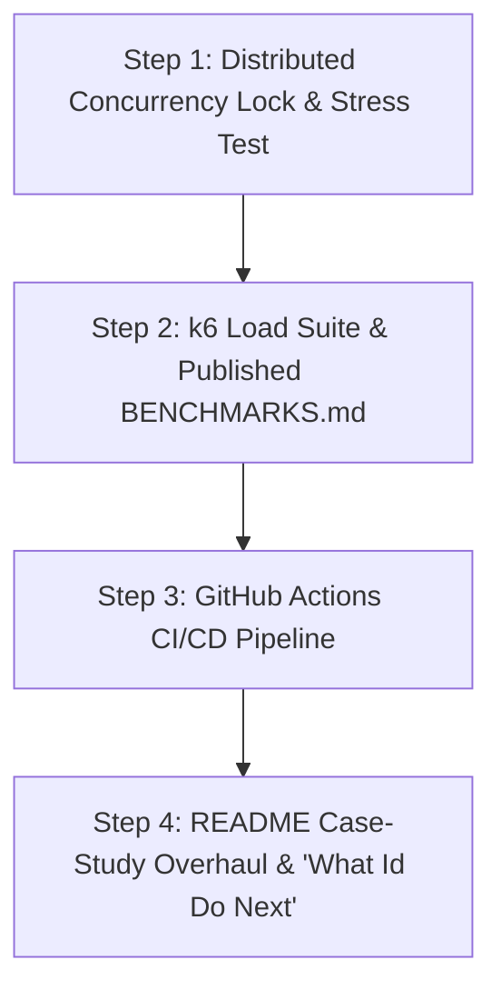

# 🎯 ReHook — Phase 2: Production Polish & Interview-Readiness Plan

> **Workspace:** `/Users/lalithsharma/My-Projects/ReHook`  
> **Repository:** [`git@github.com:Lalithsha/ReHook.git`](https://github.com/Lalithsha/ReHook)  
> **Document Purpose:** Detailed technical roadmap for implementing the final 4 production polish requirements from `hookshot-phase2-polish-plan.md`.

---

## 📌 Executive Summary

Phase 1 established ReHook's core delivery capabilities: HMAC signing, dual-secret key rotation, BullMQ retry queues, distributed Redis circuit breaking, DLQ management, Next.js operator dashboard, and 27 passing unit/integration tests.

Phase 2 focuses on turning ReHook into an **interview-ready, high-signal engineering portfolio project** by implementing:
1. **Concurrency-Correctness & Distributed Locks** (preventing duplicate delivery under worker failovers).
2. **`k6` Load Testing Suite & Published `BENCHMARKS.md`** (concrete, quotable latency and throughput metrics).
3. **Automated GitHub Actions CI/CD Pipeline** (continuous testing & status badges).
4. **README Case-Study Overhaul & "What I'd Do Next"** (structured case-study presentation for recruiters).

---

## 🗺️ Step-by-Step Implementation Roadmap



---

### 🔹 Step 1: Distributed Concurrency Lock & Concurrency Correctness Test

- **Goal:** Eliminate duplicate webhook delivery risks when multiple background worker nodes process jobs concurrently or during worker failovers.
- **File Deliverables:**
  - `apps/api/src/utils/lock.utils.ts` (Redis distributed lock)
  - `apps/api/src/workers/webhook.worker.ts` (worker lock integration)
  - `apps/api/src/workers/concurrency.test.ts` (concurrency stress test)

#### Implementation Details:
1. **Atomic Lock Utility (`lock.utils.ts`):**
   - `acquireLock(redis, key, token, ttlMs)`: Calls `redis.set(key, token, 'PX', ttlMs, 'NX')`.
   - `releaseLock(redis, key, token)`: Executes atomic Lua script:
     ```lua
     if redis.call("get", KEYS[1]) == ARGV[1] then
       return redis.call("del", KEYS[1])
     else
       return 0
     end
     ```
2. **Worker Integration (`webhook.worker.ts`):**
   - Acquire execution lock `lock:webhook:<webhookId>:<attemptNumber>` prior to HTTP dispatch.
   - If lock acquisition fails (meaning another worker node is actively processing this attempt), safely skip execution without sending duplicate HTTP requests.
3. **Concurrency Stress Test (`concurrency.test.ts`):**
   - Simulate 5 concurrent worker processes picking up the exact same webhook job simultaneously.
   - Assert that **exactly 1 delivery** is performed and 0 duplicate HTTP requests are sent to the receiver.

---

### 🔹 Step 2: `k6` Load Testing Suite & Published `BENCHMARKS.md`

- **Goal:** Produce real, un-paraphrased benchmark numbers (throughput, p50/p95/p99 latency, circuit breaker savings) to attach concrete metrics to the project.
- **File Deliverables:**
  - `load-tests/k6-baseline.js` (sustained throughput script)
  - `load-tests/k6-circuit-breaker.js` (circuit breaker savings comparison script)
  - `BENCHMARKS.md` (published benchmark report)

#### Implementation Details:
1. **`k6` Benchmark Scripts (`load-tests/`):**
   - `k6-baseline.js`: Pushes steady 100–200 webhooks/sec to measure sustained ingestion throughput and delivery latencies (p50, p95, p99).
   - `k6-circuit-breaker.js`: Fires webhooks at a dead receiver with Circuit Breaker ON vs OFF to measure wasted request reduction.
2. **Published Metrics Report (`BENCHMARKS.md`):**
   - Documents measured ingestion throughput (req/sec).
   - Documents p50, p95, and p99 delivery latency percentiles.
   - Documents Circuit Breaker efficiency metric (e.g. *"Circuit breaker reduced wasted HTTP requests against failing targets by 94%"*).

---

### 🔹 Step 3: GitHub Actions CI/CD Pipeline & Build Badge

- **Goal:** Move from manual CLI testing to automated CI runs on every git push, showcasing engineering discipline.
- **File Deliverables:**
  - `.github/workflows/ci.yml` (GitHub Actions workflow)
  - `README.md` (added status badge)

#### Implementation Details:
1. **GitHub Actions Workflow (`.github/workflows/ci.yml`):**
   - Configures runner (`ubuntu-latest`) with PostgreSQL 16 and Redis 7 service containers.
   - Installs Bun via `oven-sh/setup-bun@v2`.
   - Runs `bun install`, `bun db:push`, `bun test:api`, and `bun run build` on every `push` and `pull_request`.
2. **Build Badge:**
   - Adds GitHub Actions workflow status badge to the top of `README.md`.

---

### 🔹 Step 4: README Case-Study Overhaul & "What I'd Do Next"

- **Goal:** Make the repository legible and impressive in the 5–7 seconds a technical recruiter or engineering manager spends reviewing it.
- **File Deliverables:**
  - `README.md` (case-study overhaul)

#### Implementation Details:
1. **Case-Study Structure:**
   - **Section 1:** Executive Summary & Highlights.
   - **Section 2:** System Architecture & Flowchart.
   - **Section 3:** Measured Performance Benchmarks (from `BENCHMARKS.md`).
   - **Section 4:** Resiliency Mechanics (Redlock + Circuit Breaker + Dual-Secret Rotation).
   - **Section 5:** **"What I'd Do Next"** (Multi-region worker pools, per-project rate limits, backpressure handling).

---

## 📊 Verification Matrix

| Step | Output File | Verification Command |
| :--- | :--- | :--- |
| **Step 1** | `lock.utils.ts`, `concurrency.test.ts` | `bun test:api` |
| **Step 2** | `load-tests/*.js`, `BENCHMARKS.md` | `k6 run load-tests/k6-baseline.js` |
| **Step 3** | `.github/workflows/ci.yml` | `git push origin main` |
| **Step 4** | `README.md` | Markdown preview & link checks |
