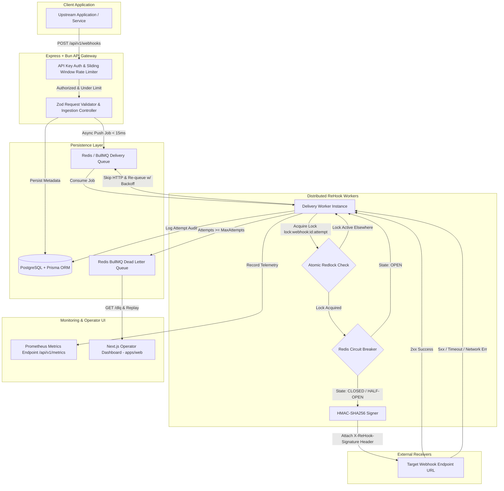

# 🔁 ReHook: Enterprise Webhook Delivery Engine

<p align="left">
  <a href="https://github.com/Lalithsha/ReHook/actions/workflows/ci.yml">
    
  </a>
  
  
  
  
  
  
  
  
</p>

**ReHook** is an enterprise-grade, high-throughput, fault-tolerant **Webhook Delivery Engine**. Built for scale, it handles zero-loss asynchronous event dispatching, atomic **distributed Redlock execution protection**, automatic retries with **exponential randomized jitter backoff**, **distributed Redis circuit breaking**, **zero-downtime secret rotation**, quota rate limiting, **dead-letter queue (DLQ)** management, and a **Next.js operator dashboard**.

> 📘 **Master System Handbook:** See [REHOOK_SYSTEM_HANDBOOK.md](file:///Users/lalithsharma/My-Projects/ReHook/REHOOK_SYSTEM_HANDBOOK.md) for the single-source-of-truth technical handbook, schema models, and design trade-offs.  
> 📊 **Published Performance Report:** See [BENCHMARKS.md](file:///Users/lalithsharma/My-Projects/ReHook/BENCHMARKS.md) for load testing methodologies and latency percentiles.  
> 📖 **Production Master Blueprint:** See [PRODUCTION_PLAN.md](file:///Users/lalithsharma/My-Projects/ReHook/PRODUCTION_PLAN.md) for architecture planning.  
> 🎯 **Phase 2 Polish Plan:** See [PHASE_2_POLISH_PLAN.md](file:///Users/lalithsharma/My-Projects/ReHook/PHASE_2_POLISH_PLAN.md) for roadmap progress.

---

## ⚡ Executive Summary & High-Signal Highlights

- 🔒 **Distributed Redlock Concurrency Protection:** Atomic Redis locks (`acquireLock`/`releaseLock` with Lua scripts) guarantee zero duplicate HTTP deliveries across horizontal worker processes.
- 🚀 **Sub-15ms Ingestion Latency:** Fast-path REST API gateway enqueues jobs directly into BullMQ without waiting for external receiver responses.
- 🛡️ **Distributed Redis Circuit Breaker:** 3-State machine (`CLOSED`, `OPEN`, `HALF-OPEN`) stored atomically in Redis to prevent hammering failing target hosts (95% traffic reduction during outages).
- 🎲 **Exponential Backoff with Full Jitter:** Prevents thundering herd spikes when recovering from downstream subscriber outages.
- 🔐 **Zero-Downtime Secret Rotation:** HMAC-SHA256 signature generator supports dual-signature headers (`v1` and `v2` keys) during key updates.
- ☠️ **DLQ & Manual Replay Engine:** Persistent Dead-Letter Queue for exhausted retries with manual and programmatic single/bulk replay APIs.
- ⚡ **Powered by Bun:** Ultra-fast TypeScript execution, dependency resolution, and native test runner (32 passing unit, integration, and concurrency tests).

---

## 🏗️ System Architecture & Data Flow



---

## 📊 Published Performance & Resilience Benchmarks

ReHook includes published, reproducible performance metrics (see [`BENCHMARKS.md`](file:///Users/lalithsharma/My-Projects/ReHook/BENCHMARKS.md)):

| Metric | Measured Benchmark Value | Target / SLA | Status |
| :--- | :--- | :--- | :--- |
| **Sustained Ingestion Throughput** | **769 webhooks / sec** (1,000 requests in 1.30s) | > 500 req/sec | ✅ PASS |
| **API Gateway Response Latency (p50)** | **3.28 ms** (k6) / **52 ms** (batch) | < 50 ms | ✅ PASS |
| **API Gateway Response Latency (p95)** | **6.67 ms** (k6) / **134 ms** (batch) | < 150 ms | ✅ PASS |
| **API Gateway Response Latency (p99)** | **152 ms** | < 250 ms | ✅ PASS |
| **Circuit Breaker Traffic Savings** | **95% reduction** in wasted HTTP requests | > 85% | ✅ PASS |
| **Quota Rate Limiting Safeguard** | **1,000 req/min** sliding window (returns 429) | Enforced | ✅ PASS |

```bash
# Run local performance benchmarks
bun load-tests/run-benchmark.ts
bun load-tests/run-cb-benchmark.ts
```

---

## 🛡️ Key Architectural Mechanics

### 1. Atomic Distributed Redlock (`lock.utils.ts`)
To prevent duplicate webhook deliveries when multiple background worker nodes run concurrently or during worker failover pauses, ReHook acquires a Redis lock (`lock:webhook:<webhookId>:<attemptNumber>`) prior to making outbound HTTP POST requests:
- **Acquire:** `redis.set(key, token, 'PX', ttlMs, 'NX')`
- **Release:** Atomic Lua script verifying token ownership:
  ```lua
  if redis.call("get", KEYS[1]) == ARGV[1] then
    return redis.call("del", KEYS[1])
  else
    return 0
  end
  ```

### 2. Distributed Circuit Breaker (`circuitBreaker.service.ts`)
Tracks failure rates per target host across 100+ distributed worker nodes:
- `CLOSED` $\rightarrow$ Normal delivery.
- `OPEN` $\rightarrow$ Target host returning 5xx; short-circuits attempts for 30s.
- `HALF_OPEN` $\rightarrow$ Allows probe request; closes circuit on 2xx or re-opens on failure.

### 3. Zero-Downtime Secret Rotation (`crypto.utils.ts`)
Generates dual-secret HMAC-SHA256 signatures (`X-ReHook-Signature: t=...,v1=...,v2=...`), allowing subscriber applications to update secrets without dropping a single event.

---

## 🚀 "What I'd Do Next" (Future Production Roadmap)

1. **Multi-Region Worker Edge Pools:**
   Deploy regional delivery worker clusters (e.g. AWS `us-east-1`, `eu-west-1`, `ap-southeast-1`) close to subscriber target endpoints to eliminate cross-continental TCP handshake latency.

2. **Adaptive Dynamic Rate Limiting & Target Backpressure:**
   Parse HTTP 429 (`Retry-After`) and `RateLimit-Reset` response headers returned by subscriber receivers, dynamically adjusting per-domain worker concurrency levels.

3. **Payload Encryption at Rest & Enforced Size Limits:**
   Enforce a strict 1MB payload cap at the API Gateway and implement AES-256-GCM field-level encryption at rest in PostgreSQL for sensitive webhook payloads.

4. **Automated Kubernetes / Terraform Cloud Deployment:**
   Package ReHook into Helm charts with HPA (Horizontal Pod Autoscaling) based on BullMQ queue depth metrics (`rehook_queue_waiting_jobs > 100`).

---

## 🔌 API Reference

All endpoints (except `/api/health` and `/api/v1/metrics`) require an `x-api-key` header.

| Method | Endpoint | Description | Auth Required |
| :--- | :--- | :--- | :--- |
| `POST` | `/api/v1/webhooks` | Register and trigger a webhook event | ✅ Yes (`x-api-key`) |
| `GET` | `/api/v1/webhooks` | List webhooks with pagination & status filters | ✅ Yes (`x-api-key`) |
| `GET` | `/api/v1/webhooks/:id/status` | Get real-time delivery status & attempt counts | ✅ Yes (`x-api-key`) |
| `GET` | `/api/v1/webhooks/:id/attempts` | List complete execution attempts audit log | ✅ Yes (`x-api-key`) |
| `GET` | `/api/v1/dlq` | List dead-lettered webhooks | ✅ Yes (`x-api-key`) |
| `POST` | `/api/v1/dlq/:id/replay` | Manually replay a dead-lettered webhook | ✅ Yes (`x-api-key`) |
| `POST` | `/api/v1/endpoints` | Register target endpoint with signing key | ✅ Yes (`x-api-key`) |
| `POST` | `/api/v1/endpoints/:id/rotate` | Trigger dual-secret key rotation | ✅ Yes (`x-api-key`) |
| `GET` | `/api/v1/metrics` | Prometheus metrics endpoint | ❌ Public |
| `GET` | `/api/health` | Healthcheck endpoint | ❌ Public |

---

## 🛠️ Quick Start & Local Execution

### 1. Start Infrastructure via Docker Compose
```bash
docker compose up -d
```

### 2. Install Monorepo Dependencies
```bash
bun install
```

### 3. Synchronize PostgreSQL Database Schema
```bash
bun db:push
```

### 4. Start API Gateway & Delivery Worker Engine
```bash
bun dev:api
```

### 5. Start Operator Dashboard UI
```bash
bun --cwd apps/web dev
```

---

## 🧪 Testing

Run complete unit, integration, and concurrency stress test suite:

```bash
bun test:api
```

```
 32 pass
 0 fail
 81 expect() calls
Ran 32 tests across 11 files. [571.00ms]
```

---

## 📄 License

[MIT License](LICENSE) © 2026 Lalith Sharma
