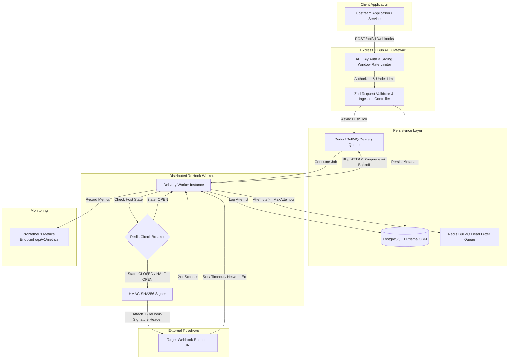

# 🔁 ReHook: Enterprise Webhook Delivery Engine

<p align="left">
  
  
  
  
  
  
</p>

A production-grade, highly available, fault-tolerant **Webhook Delivery Platform**. ReHook handles asynchronous event ingestion, automatic retries with **exponential randomized jitter backoff**, **distributed Redis circuit breaking**, **zero-downtime secret rotation**, rate limiting, and **dead-letter queue (DLQ)** management.

> 📖 **Production Master Blueprint & Architecture:** See [PRODUCTION_PLAN.md](file:///Users/lalithsharma/My-Projects/ReHook/PRODUCTION_PLAN.md) for detailed phase-wise design, trade-offs, and system benchmarking.  
> ♊ **AI Assistant Handbook:** See [gemini.md](file:///Users/lalithsharma/My-Projects/ReHook/gemini.md) for developer context.

---

## ⚡ Core Features

- 🚀 **Sub-15ms Ingestion Latency:** Fast-path REST API gateway enqueues jobs directly into BullMQ without waiting for external receiver responses.
- 🛡️ **Distributed Redis Circuit Breaker:** 3-State machine (`CLOSED`, `OPEN`, `HALF-OPEN`) stored atomically in Redis to prevent hammering failing target hosts.
- 🎲 **Exponential Backoff with Full Jitter:** Prevents thundering herd spikes when recovering from downstream subscriber outages.
- 🔐 **Zero-Downtime Secret Rotation:** HMAC-SHA256 signature generator supports dual-signature headers (`v1` and `v2` keys) during key updates.
- 📊 **Prometheus Telemetry:** Built-in `/api/v1/metrics` endpoint exposing ingestion counters, 95th percentile latency histograms, and delivery failure rates.
- ☠️ **DLQ & Manual Replay Engine:** Persistent Dead-Letter Queue for exhausted retries with manual and programmatic single/bulk replay APIs.
- ⚡ **Powered by Bun:** Ultra-fast TypeScript execution, dependency resolution, and native test runner.

---

## 🏗️ Architecture & Data Flow



---

## 🔌 API Reference

All endpoints (except `/api/health` and `/api/v1/metrics`) require an `x-api-key` header.

| Method | Endpoint | Description | Auth Required |
| :--- | :--- | :--- | :--- |
| `POST` | `/api/v1/webhooks` | Register and trigger a webhook event | ✅ Yes (`x-api-key`) |
| `GET` | `/api/v1/webhooks/:id/status` | Get real-time delivery status & attempt counts | ✅ Yes (`x-api-key`) |
| `GET` | `/api/v1/webhooks/:id/attempts` | List complete execution attempts audit log | ✅ Yes (`x-api-key`) |
| `POST` | `/api/v1/dlq/:id/replay` | Manually replay a dead-lettered webhook | ✅ Yes (`x-api-key`) |
| `GET` | `/api/v1/metrics` | Prometheus metrics endpoint | ❌ Public |
| `GET` | `/api/health` | Healthcheck endpoint | ❌ Public |

---

### 📝 Sample Payloads & Requests

#### 1. Register Webhook Event (`POST /api/v1/webhooks`)

```bash
curl -X POST http://localhost:3001/api/v1/webhooks \
  -H "Content-Type: application/json" \
  -H "x-api-key: super_secret_rehook_key_123" \
  -d '{
    "target_url": "https://httpbin.org/post",
    "event_type": "order.completed",
    "payload": {
      "order_id": "ORD-9912",
      "amount": 1499.50,
      "currency": "USD"
    },
    "headers": {
      "Custom-Header": "Value"
    },
    "retry_config": {
      "max_attempts": 5,
      "initial_delay_ms": 5000
    }
  }'
```

#### Response:
```json
{
  "message": "Webhook accepted for processing",
  "webhook_id": "c1f7b8d0-e12a-45ef-8910-123456789abc",
  "status": "pending",
  "created_at": "2026-07-20T00:45:00.000Z"
}
```

---

## 🔐 Zero-Downtime Dual-Secret Key Rotation

ReHook implements a **Dual-Key Signature Protocol** to prevent delivery failures during secret updates:

```http
X-ReHook-Signature: t=1784487755,v1=9f8a...c12,v2=3b4e...d88
X-ReHook-Timestamp: 1784487755
```

1. When updating recipient keys, `secret_v1` is shifted to `secret_v2`, and the new secret becomes `secret_v1`.
2. ReHook automatically signs incoming payloads with **both keys**.
3. Recipients verify `v1` first, falling back to `v2` during the grace period.

---

## 🛠️ Quick Start

### 1. Prerequisites

- **Bun** (v1.1.0 or higher): `curl -fsSL https://bun.sh/install | bash`
- **Docker & Docker Compose** (for PostgreSQL and Redis)

### 2. Start Infrastructure Services (PostgreSQL + Redis)

```bash
docker run -d -p 5432:5432 -e POSTGRES_PASSWORD=postgres -e POSTGRES_DB=rehook --name rehook-postgres postgres:16
docker run -d -p 6379:6379 --name rehook-redis redis:7-alpine
```

### 3. Install Dependencies & Configure Environment

```bash
# Clone the repository
git clone git@github.com:Lalithsha/ReHook.git
cd ReHook

# Install Bun dependencies across monorepo
bun install

# Configure environment file
cp apps/api/.env.example apps/api/.env
```

### 4. Push Database Schema (Prisma)

```bash
bun db:push
```

### 5. Start Application Server & Delivery Workers

```bash
# Start API Gateway and BullMQ Workers in dev mode
bun dev:api
```

---

## 🧪 Testing

ReHook includes unit tests powered by Bun's native test runner covering HMAC cryptographic signatures, dual-secret rotation headers, and exponential backoff jitter calculations:

```bash
bun test:api
```

---

## 📄 License

[MIT License](LICENSE) © 2026 Lalith Sharma
