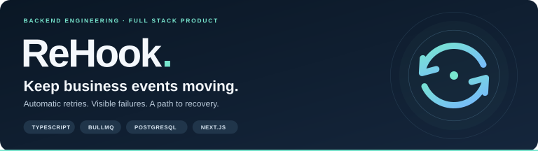
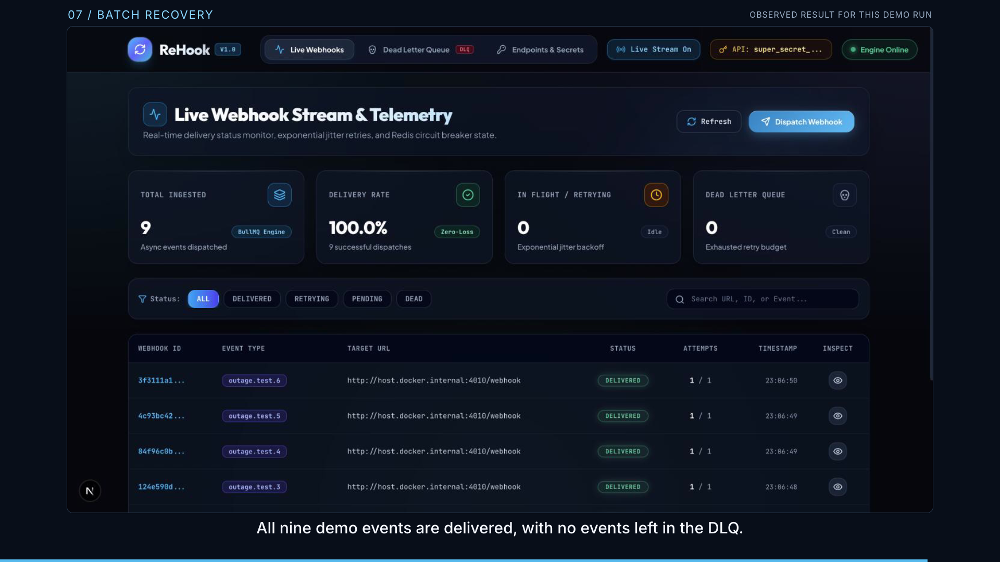
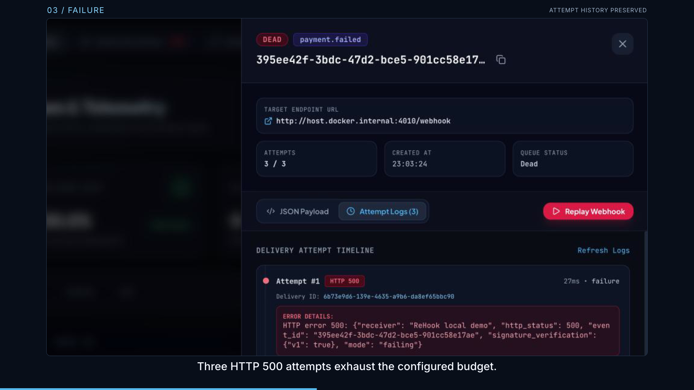
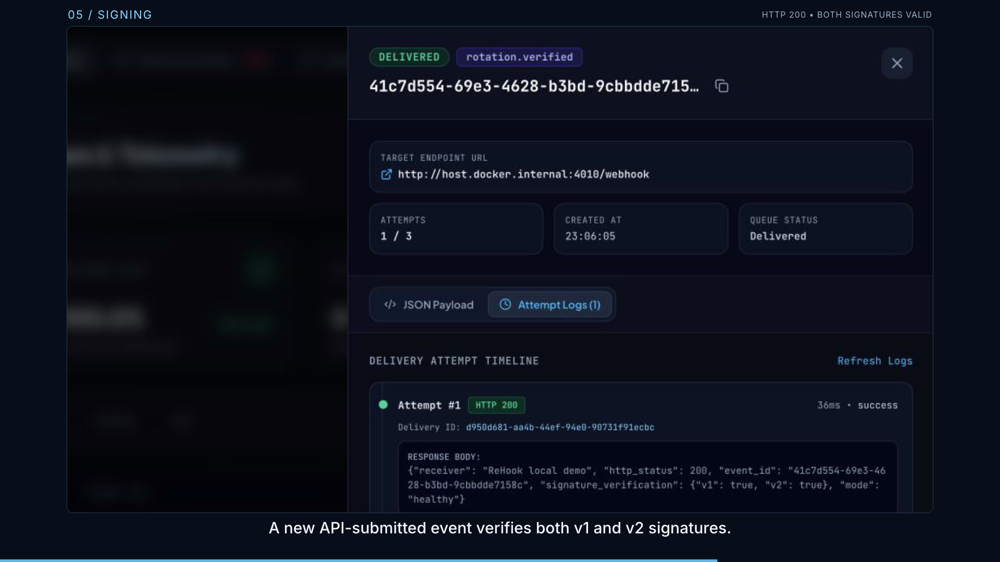
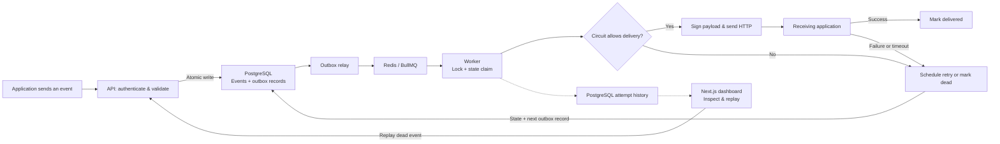

<p align="center">
  
</p>

# ReHook · Webhook delivery & recovery

**When one service goes down, important events should still have a path forward.**

ReHook is a backend platform and operator dashboard that sends events between applications, retries failed deliveries, and lets an operator inspect and replay events that need attention. Think of an online store sending an “order paid” notification to a fulfillment service: if the receiver is unavailable, ReHook tracks what happened and provides a way to recover.

Built with **TypeScript, Bun, Express, PostgreSQL, Redis, BullMQ, and Next.js**.

[](https://github.com/Lalithsha/ReHook/actions/workflows/ci.yml)

**[See the product](#see-the-product)** · **[Results & evidence](#results--evidence)** · **[How it works](#how-it-works)** · **[Run locally](#run-locally)** · **[Technical handbook](docs/REHOOK_SYSTEM_HANDBOOK.md)**

> **Project status:** A locally runnable engineering portfolio project. The demos below play directly on GitHub; there is no hosted application to sign up for.

## Why this matters

A webhook is an HTTP notification from one application to another. A successful checkout, account update, or shipment can trigger one. Networks fail and receiving services go offline—so sending a request once is rarely enough.

| When this happens… | ReHook provides… | Why it helps |
| --- | --- | --- |
| A receiver fails or times out | Automatic retries with increasing, randomized delays | Temporary outages can recover without someone resending every event |
| An endpoint keeps failing | A shared circuit breaker that pauses outbound requests | Workers stop repeatedly calling a known failing destination |
| The retry budget runs out | A dead-letter queue: a visible list of events needing attention | Operators can inspect the failure and replay the event after fixing the cause |
| A signing secret needs changing | Signatures with both the existing and new key during rotation | Receivers can transition keys while continuing to verify events |
| The database accepts an event but the queue is unavailable | A transactional outbox that retains work awaiting publication | Accepted events have a durable scheduling record in PostgreSQL |

## See the product

### One screen to understand delivery health

The operator dashboard shows delivery status, events still in progress, and events waiting for recovery. Each event has a payload and attempt history to explain its journey.



*Real application capture from the local demo. The nine-event result describes this recorded run.*

### Watch the complete workflow · 2 min 18 sec

Register a receiver → send an event → simulate failure → inspect retries → replay → rotate keys → recover from an outage.

https://github.com/user-attachments/assets/f255861a-30c6-4d8f-8b21-5ae64a4a32c9

<details>
<summary><strong>Jump to a specific capability</strong></summary>

| Time | What to look for |
| --- | --- |
| 00:06 | Register a receiver and its signing secret |
| 00:17 | Dispatch an event and inspect signed delivery |
| 00:42 | Simulate HTTP 500 errors and observe automatic retries |
| 01:07 | Inspect the dead-letter queue and replay a failed event |
| 01:25 | Rotate a secret and verify both signatures |
| 01:44 | Simulate an outage and observe circuit-open suppression |
| 01:57 | Restore the receiver and replay the outage events |
| 02:12 | Final recap |

</details>

<details>
<summary><strong>Short on time? Watch the 20-second architecture showcase</strong></summary>

A brief introduction to the delivery engine, local benchmark, and resilience features. Measurement context is explained below.

https://github.com/user-attachments/assets/4c3fcadd-c41a-4be5-a632-5642fc8f2ac6

</details>

## Results & evidence

The impact demonstrated here is **recoverability, visibility, and controlled delivery under failure**. These are local engineering results, not customer adoption or production service guarantees.

| Achievement | Evidence | What it establishes |
| --- | --- | --- |
| **9 of 9 demo events delivered; 0 left dead** | [Recorded demo evidence](docs/evidence/recorded-demo.json) and dashboard above | Failed events were inspectable and recovered through replay after the receiver returned |
| **Both signing keys verified successfully** | [Receiver response](docs/evidence/recorded-demo.json) reports `v1: true`, `v2: true`, HTTP 200 | Dual-key signing worked for a newly submitted event during rotation |
| **An open circuit suppressed an HTTP call** | [Attempt history](docs/evidence/recorded-demo.json) records `circuit_open` with no HTTP status, followed by HTTP 200 after recovery | The recorded outage exercised request suppression and recovery |
| **769 accepted requests/sec in a local burst** | [Published benchmark](docs/BENCHMARKS.md): 1,000 requests, concurrency 50, 1.30 sec; all returned success | Historical API ingestion performance on the documented local environment |
| **95 of 100 simulated checks blocked** | [Circuit-breaker exercise](load-tests/run-cb-benchmark.ts): record five failures, then check 95 more decisions | State-based suppression in a Redis-backed simulation |

**Measurement context:** The throughput report predates the current transactional-outbox changes and should be rerun to measure the current version. It measures API acceptance, not end-to-end delivery. The 95% circuit result comes from a simulation; that script does not send 100 real HTTP requests. [Benchmark methodology and reported latency](docs/BENCHMARKS.md).

## Built for the moments that go wrong

### Failures stay explainable

A failed event retains its original payload and attempt history. The operator can see the HTTP response, elapsed time, and delivery identifier, then replay a dead event after addressing the underlying problem.



*In the demo, a three-attempt budget was exhausted before the event was replayed successfully.*

<details>
<summary><strong>See proof of signing-key rotation</strong></summary>



The receiver confirmed both HMAC-SHA256 signatures on a new event after rotation. The overlap lets receivers adopt the new key while the previous key remains available.

</details>

## How it works

**Accept and store first. Deliver in the background. Keep a record of every attempt.**


```mermaid
flowchart LR
    APP["Application sends an event"] --> API["API: authenticate & validate"]
    API -->|Atomic write| TX["PostgreSQL<br/>Events + outbox records"]
    TX --> RELAY["Outbox relay"]
    RELAY --> Q["Redis / BullMQ"]
    Q --> W["Worker<br/>Lock + state claim"]
    W --> CB{"Circuit allows delivery?"}
    CB -->|Yes| SEND["Sign payload & send HTTP"]
    SEND --> REC["Receiving application"]
    REC -->|Success| OK["Mark delivered"]
    REC -->|Failure or timeout| RETRY["Schedule retry or mark dead"]
    CB -->|No| RETRY
    RETRY -->|State + next outbox record| TX
    W -.-> AUDIT["PostgreSQL attempt history"]
    AUDIT -.-> UI["Next.js dashboard<br/>Inspect & replay"]
    UI -->|Replay dead event| API
```

An **outbox** is a database record of work waiting to be sent to the queue. ReHook creates it in the same transaction as the event. The relay retries publication when Redis is available; the request path does not wait for the receiving application.

### Engineering decisions worth exploring

| Decision | Implementation | Tradeoff / purpose |
| --- | --- | --- |
| Durable handoff | [Transactional event + outbox creation](apps/api/src/services/webhook.service.ts), [relay](apps/api/src/services/outbox.service.ts) | Adds a database write and polling delay to retain work across queue-publication failures |
| Coordinate workers | [Redis lease with renewal and ownership-checked Lua release](apps/api/src/utils/lock.utils.ts), [conditional database claim](apps/api/src/workers/webhook.worker.ts) | Reduces concurrent duplicate execution; does not create an exactly-once guarantee |
| Back off under failure | [Exponential jitter](apps/api/src/utils/backoff.utils.ts), [host-based circuit state](apps/api/src/services/circuitBreaker.service.ts) | Spreads retry timing and pauses failing hosts; open-circuit evaluations can consume the attempt budget |
| Preserve event identity | [Stable event ID and separate delivery IDs](apps/api/src/workers/webhook.worker.ts) | Receivers can deduplicate business events and correlate individual attempts |
| Authenticate and isolate | [Project-scoped API authentication](apps/api/src/middlewares/auth.middleware.ts), [target URL checks](apps/api/src/utils/targetUrl.utils.ts) | Scopes data access and restricts private/reserved targets in production mode |
| Make failures observable | [Delivery/outbox/queue metrics](apps/api/src/services/telemetry.service.ts), [worker metrics and shutdown](apps/api/src/workers/init.ts) | Exposes operational state and drains active jobs during normal shutdown |

**Delivery semantics:** The design targets at-least-once delivery with a bounded attempt budget and operator replay. Receivers should deduplicate using `X-ReHook-Event-ID`; a retry can repeat an HTTP request. Multi-node Redlock and exactly-once delivery are not implemented guarantees.

**Next engineering steps:** Recover events stranded in `processing` after a worker crash, add atomic ownership of half-open circuit probes, replace browser-visible development API keys with server-side authentication, and rerun failure/load tests against the current implementation. [Hardening plan](docs/PRODUCTION_HARDENING_IMPLEMENTATION_PLAN.md).

## Technology & project structure

| Layer | Technologies | Responsibility |
| --- | --- | --- |
| API | TypeScript · Bun · Express · Zod | Authentication, validation, event ingestion, inspection, replay |
| Persistence | PostgreSQL · Prisma | Events, endpoint keys, attempt history, transactional outbox |
| Queue & workers | Redis · BullMQ | Background delivery, scheduling, concurrency coordination |
| Operator UI | Next.js · React · Tailwind CSS | Delivery dashboard, failure inspection, endpoint management |
| Operations | Docker Compose · Prometheus metrics · GitHub Actions | Local environment, observability, automated checks |

```text
apps/api/       API, delivery workers, Prisma schema & migrations
apps/web/       Operator dashboard
packages/       Shared UI and TypeScript/ESLint configuration
load-tests/     Native and k6 benchmark scripts
docs/           Architecture, benchmarks, visual assets & demo evidence
demo-output/    Recorded full product walkthrough
brag-output/    Short architecture showcase
```

## Run locally

**Prerequisites:** Docker with Docker Compose. The Compose setup runs PostgreSQL, Redis, the API, delivery workers, and the dashboard.

```bash
git clone https://github.com/Lalithsha/ReHook.git
cd ReHook
docker compose up --build -d
```

| Service | Local address |
| --- | --- |
| Operator dashboard | http://localhost:3000 |
| API liveness / dependency readiness | http://localhost:3001/api/health · http://localhost:3001/api/ready |
| API summary metrics | http://localhost:3001/api/v1/metrics |
| Worker Prometheus metrics | http://localhost:9464/metrics |

The Compose file includes development credentials and allows local/private receiver URLs for testing. It is configured for local development.

<details>
<summary><strong>Try a delivery against the included mock receiver</strong></summary>

With Bun installed, start the receiver on your host in a separate terminal:

```bash
bun install
bun mock:receiver
```

Submit an event to the Dockerized API. Docker Desktop on macOS/Windows can reach the host receiver through `host.docker.internal`:

```bash
curl -X POST http://localhost:3001/api/v1/webhooks \
  -H 'Content-Type: application/json' \
  -H 'x-api-key: super_secret_rehook_key_123' \
  -d '{
    "target_url": "http://host.docker.internal:4000/webhook",
    "event_type": "order.paid",
    "payload": {"order_id": "demo-001", "amount": 49.99},
    "retry_config": {"max_attempts": 3, "initial_delay_ms": 1000}
  }'
```

The API returns **202 Accepted** with the event ID. Look for it in the dashboard; delivery happens asynchronously. To exercise failure handling, submit another event with `?mode=fail` appended to the receiver URL. On Linux, configure the Docker host gateway or use a receiver reachable from the worker container.

</details>

<details>
<summary><strong>Run API tests with local PostgreSQL and Redis</strong></summary>

With Bun installed and Compose running:

```bash
bun install
cp apps/api/.env.example apps/api/.env
bun db:generate
bun test:api
```

Adjust the copied environment file if your local ports or credentials differ. Prisma client generation is required after schema changes. Test files cover authentication, validation, signatures, backoff, locks, circuit breaking, and worker/API behavior. The live CI badge above links to current results.

</details>

## API at a glance

Protected routes use `x-api-key`; project-scoped clients can also send `x-project-id`.

| Capability | Routes |
| --- | --- |
| Send & inspect events | `POST /api/v1/webhooks` · `GET /api/v1/webhooks` |
| Delivery status & audit history | `GET /api/v1/webhooks/:id/status` · `GET /api/v1/webhooks/:id/attempts` |
| Inspect failed events | `GET /api/v1/dlq` · `GET /api/v1/dlq/:id` |
| Replay one dead event | `POST /api/v1/dlq/:id/replay` |
| Register & list receivers | `POST /api/v1/endpoints` · `GET /api/v1/endpoints` |
| Rotate a signing secret | `POST /api/v1/endpoints/:id/rotate` |

[Route definitions](apps/api/src/api/routes/webhook.routes.ts) · [Request validation](apps/api/src/api/validators/webhook.validator.ts)

## Explore further

- [System handbook](docs/REHOOK_SYSTEM_HANDBOOK.md) — schema, lifecycle, implementation details, and design tradeoffs.
- [Performance report](docs/BENCHMARKS.md) — historical local results and reproduction scripts.
- [Production hardening plan](docs/PRODUCTION_HARDENING_IMPLEMENTATION_PLAN.md) — durability, security, identity, observability, and remaining work.
- [Demo evidence](docs/evidence/recorded-demo.json) — selected results from the recorded local run.
- [Visual sources](docs/assets/README.md) — provenance of the real UI captures used here.

---

Built by **[Lalith Sharma](https://github.com/Lalithsha)** · Backend systems, reliability, and full stack product engineering.
