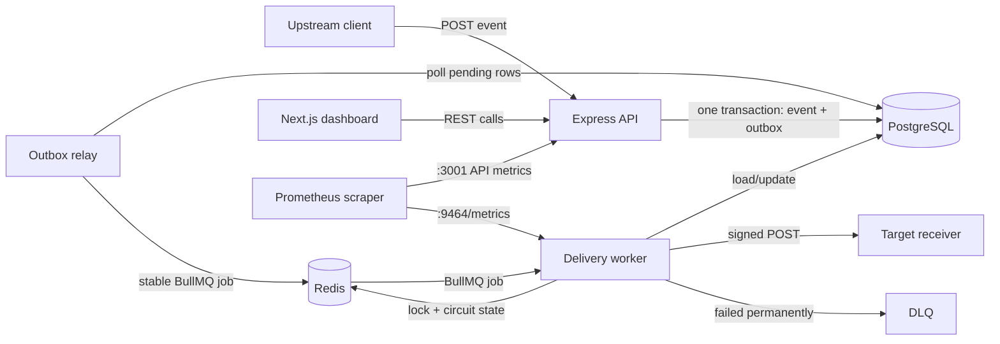
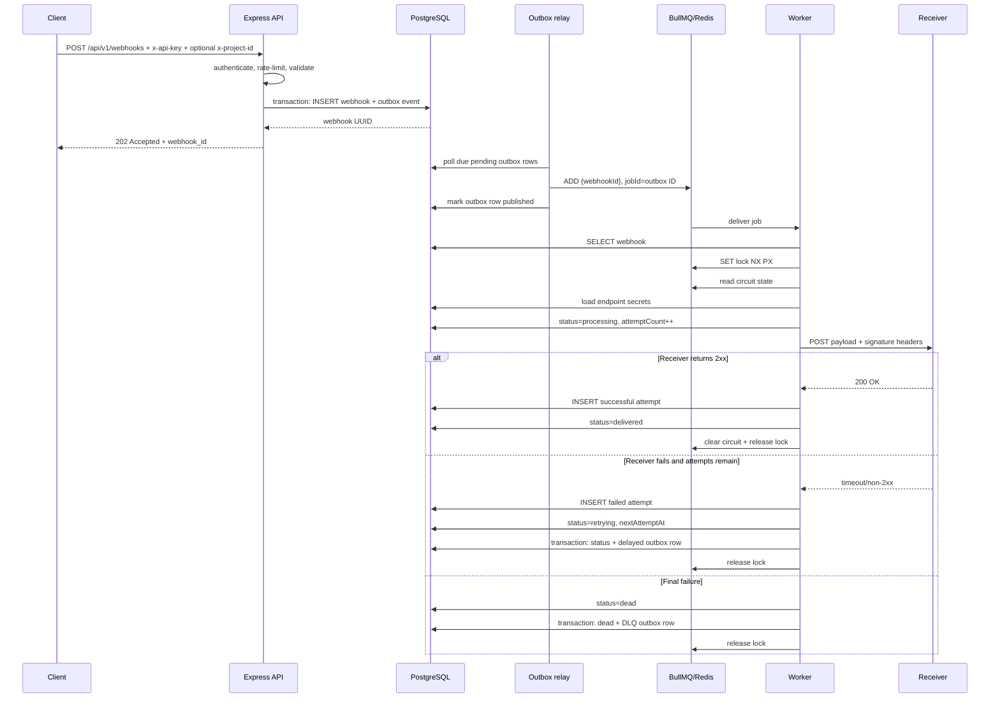
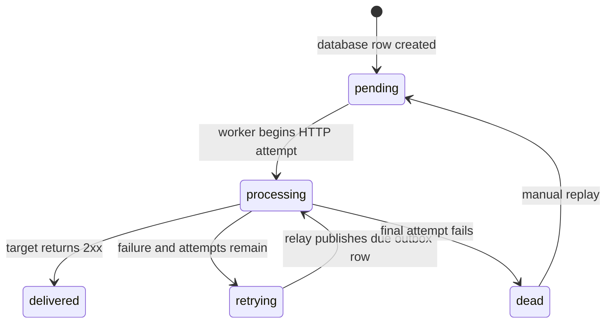
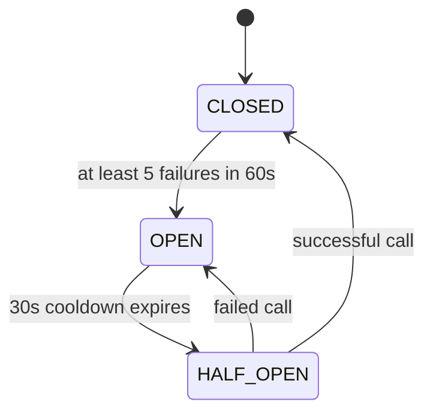
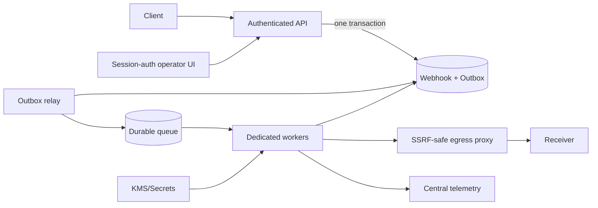

# ReHook — Beginner-to-Interview, Code-Grounded Learning Guide

> **Purpose:** Teach the concepts, runtime flow, implementation, trade-offs, limitations, testing, and interview explanation of this repository from first principles.
>
> **Code snapshot reviewed:** Current working tree on 2026-08-08, including the production-hardening work: transactional outbox, stable event identity, persisted delivery identity, project-scoped authentication, guarded replay, SSRF validation, readiness, worker metrics, lease renewal, graceful shutdown, and committed Prisma migrations.
>
> **How to use this guide:** Read Chapters 1–5 for the mental model, Chapters 6–15 with the code open, then use Chapters 16–20 for practice and interviews.

---

## Table of contents

1. [The problem ReHook solves](#1-the-problem-rehook-solves)
2. [Vocabulary from zero](#2-vocabulary-from-zero)
3. [Architecture and technology choices](#3-architecture-and-technology-choices)
4. [One webhook, end to end](#4-one-webhook-end-to-end)
5. [Delivery semantics: what is actually guaranteed](#5-delivery-semantics-what-is-actually-guaranteed)
6. [Boot, configuration, middleware, and routes](#6-boot-configuration-middleware-and-routes)
7. [Database and Prisma, line by line](#7-database-and-prisma-line-by-line)
8. [Fast-path ingestion and BullMQ](#8-fast-path-ingestion-and-bullmq)
9. [The delivery worker, line by line](#9-the-delivery-worker-line-by-line)
10. [Retries, exponential backoff, and full jitter](#10-retries-exponential-backoff-and-full-jitter)
11. [Distributed circuit breaker](#11-distributed-circuit-breaker)
12. [Distributed locking and duplicate prevention](#12-distributed-locking-and-duplicate-prevention)
13. [Authentication, rate limiting, HMAC, and rotation](#13-authentication-rate-limiting-hmac-and-rotation)
14. [DLQ, replay, observability, and dashboard](#14-dlq-replay-observability-and-dashboard)
15. [Testing, benchmarks, and local practice](#15-testing-benchmarks-and-local-practice)
16. [Complexity and scaling analysis](#16-complexity-and-scaling-analysis)
17. [Current gaps and production improvements](#17-current-gaps-and-production-improvements)
18. [Interview-ready explanation](#18-interview-ready-explanation)
19. [Interview questions and answers](#19-interview-questions-and-answers)
20. [Learning and practice plan](#20-learning-and-practice-plan)

---

# 1. The problem ReHook solves

## 1.1 What is a webhook?

A webhook is an HTTP request sent automatically when an event happens.

Example: a payment service finishes a payment. It needs to tell a merchant application:

```http
POST https://merchant.example/webhooks
Content-Type: application/json

{
  "event": "payment.completed",
  "payment_id": "pay_123",
  "amount": 499
}
```

This is sometimes called a **reverse API**:

- In a normal API, the consumer asks, “Has payment `pay_123` completed?”
- With a webhook, the payment system pushes the answer when the event occurs.

## 1.2 Why not send the HTTP request directly?

Suppose the business application does this synchronously:

```text
save order -> call merchant webhook -> wait 10 seconds -> finish request
```

If the merchant is slow or offline, the business operation becomes slow or fails. One unreliable external system can therefore damage the upstream system.

ReHook inserts a durable asynchronous acceptance boundary:

```text
client -> ReHook API -> PostgreSQL(webhook + outbox) -> 202 Accepted
                              |
                              v
                    relay -> Redis queue -> worker -> receiver
```

The API accepts and records work quickly. A worker performs the unreliable network call separately. This is **decoupling**: ingestion and delivery can proceed at different speeds and fail independently.

## 1.3 Concrete scenario used throughout this guide

An e-commerce service sends `order.shipped` to a warehouse partner.

1. The e-commerce service calls ReHook.
2. ReHook validates and records the event.
3. The same database transaction records an outbox event.
4. The relay enqueues a small job containing only the database ID, then a worker loads the event.
5. It signs the payload and calls the warehouse.
6. A `200` response marks it delivered.
7. A timeout or non-2xx response schedules a randomized retry.
8. After all attempts fail, it becomes `dead` and can be replayed by an operator.

---

# 2. Vocabulary from zero

| Term | Plain meaning | ReHook example |
|---|---|---|
| API | A contract for software to communicate | `POST /api/v1/webhooks` |
| HTTP method | The requested operation | `POST` creates/dispatches; `GET` reads |
| HTTP status | Numeric result | `202` accepted, `400` invalid, `401` unauthenticated, `429` limited |
| Header | Request metadata | `x-api-key`, `X-ReHook-Signature` |
| Payload/body | Main request data | The event JSON |
| Middleware | Code run before the controller | auth and rate limiter |
| Controller | HTTP adapter that parses input and formats output | `WebhookController` |
| Service | Business/data operation behind a controller | `WebhookService.registerWebhook` |
| ORM | Maps code objects to database rows | Prisma |
| Queue | Buffer of work waiting for consumers | BullMQ delivery queue |
| Producer | Adds work to a queue | outbox relay |
| Consumer/worker | Removes and processes work | `deliveryWorker` |
| Broker | Infrastructure holding queue state | Redis |
| Retry | Another attempt after failure | due outbox row becomes a BullMQ job |
| Backoff | Increasing wait between attempts | roughly 5s, 10s, 20s caps |
| Jitter | Randomness added to the wait | random from zero to the cap |
| DLQ | Isolation area for exhausted work | logical `dead` rows plus BullMQ DLQ |
| HMAC | Keyed integrity/authenticity digest | signs timestamp + JSON payload |
| Secret rotation | Replacing a key without abrupt breakage | new `v1`, old `v2` |
| Circuit breaker | Stops calls to a repeatedly failing dependency | `CLOSED/OPEN/HALF_OPEN` |
| Distributed lock | Shared mutex visible to multiple processes | Redis `SET NX PX` |
| Idempotency | Repeating an operation has no extra effect | receiver should deduplicate delivery IDs/event IDs |
| Telemetry | Measurements about a running system | Prometheus counters/histogram |
| p95 latency | 95% of observations are at or below this value | benchmark latency percentile |
| Horizontal scaling | Add more processes/machines | multiple BullMQ workers |
| TTL | Automatic expiration time | lock and rate-limit keys |

## 2.1 Synchronous versus asynchronous

**Synchronous:** caller waits for the final work to finish.

```text
caller -------- request --------> receiver
caller <------- final result ----- receiver
```

**Asynchronous:** caller receives acceptance; final work happens later.

```text
caller -> API -> queue
caller <- 202
                    queue -> worker -> receiver
```

HTTP `202 Accepted` specifically means “the request was accepted for processing,” not “delivery succeeded.” The caller later checks status.

## 2.2 Durability versus availability

- **Durability** asks whether accepted data survives crashes.
- **Availability** asks whether the system can respond now.
- PostgreSQL stores business state and audit history durably.
- Redis stores queue, limiter, lock, and circuit state. Docker gives Redis a volume, but production durability also depends on Redis persistence and replication settings not defined here.

---

# 3. Architecture and technology choices

## 3.1 Repository layout

```text
ReHook/
├── apps/api/              Express API, services, workers, Prisma, tests
├── apps/web/              Next.js operator dashboard
├── apps/docs/             Placeholder/documentation Next.js app
├── packages/              Shared monorepo configs and small UI package
├── load-tests/            k6 ingestion and circuit-breaker workloads
├── docs/                  Architecture, benchmarks, plans, this guide
├── docker-compose.yml     PostgreSQL, Redis, API, worker, dashboard
├── package.json           Bun workspaces + Turbo scripts
└── turbo.json             Monorepo task orchestration
```

## 3.2 Component diagram



## 3.3 Why each technology is here

| Technology | Job | Reasonable benefit | Cost/trade-off |
|---|---|---|---|
| Bun | runtime, package manager, tests | fast TypeScript workflow | smaller ecosystem than Node |
| Express | HTTP server | simple, familiar middleware model | application must assemble validation/errors itself |
| Zod | runtime validation | TypeScript types do not validate network JSON | another schema to maintain |
| PostgreSQL | source of business/audit state | relations, indexes, durable transactions | higher latency than memory |
| Prisma | ORM and generated types | type-safe queries and declarative schema | abstraction/migration tooling overhead |
| Redis | fast shared coordination | queue, sorted sets, counters, locks | extra dependency and memory constraints |
| BullMQ | Redis-backed job queue | job execution and worker concurrency | exactly-once is not guaranteed |
| Prometheus client | metrics | scrape-based operational measurements | process-local metrics require correct topology |
| Next.js | operator UI | React dashboard and routing | exposing browser-side credentials is unsafe in production |
| Docker Compose | local multi-service environment | reproducible startup | not a production orchestrator |

## 3.4 Where processes run

`docker-compose.yml` starts five services:

1. `postgres` on `5432`.
2. `redis` on `6379`.
3. `api` on `3001`.
4. `worker` with a metrics endpoint on `9464`.
5. `web` on `3000`.

The API and worker have separate entrypoints. [`server.ts`](../apps/api/src/server.ts) serves HTTP only, while the dedicated `worker` service runs `workers/init.ts` and consumes BullMQ jobs. This keeps API and delivery capacity independently scalable.

---

# 4. One webhook, end to end

## 4.1 Sequence diagram



## 4.2 Example request

```bash
curl -X POST http://localhost:3001/api/v1/webhooks \
  -H 'Content-Type: application/json' \
  -H 'x-api-key: super_secret_rehook_key_123' \
  -d '{
    "target_url": "http://localhost:4000/webhook?mode=ok",
    "event_type": "order.shipped",
    "payload": {"order_id":"ord_42","carrier":"DHL"},
    "retry_config": {"max_attempts":5,"initial_delay_ms":5000}
  }'
```

Typical API response:

```json
{
  "message": "Webhook accepted for processing",
  "webhook_id": "a UUID",
  "status": "pending",
  "created_at": "an ISO timestamp"
}
```

Follow it with:

```bash
curl -H 'x-api-key: super_secret_rehook_key_123' \
  http://localhost:3001/api/v1/webhooks/WEBHOOK_ID/status
```

## 4.3 State machine



`failed` exists in the Prisma enum and frontend type but the current worker never assigns it.

---

# 5. Delivery semantics: what is actually guaranteed

This is the most important interview section.

## 5.1 At-most-once, at-least-once, exactly-once

| Semantic | Meaning | Consequence |
|---|---|---|
| At-most-once | zero or one delivery | may lose an event, never deliberately retries |
| At-least-once | one or more deliveries | avoids loss through retries, duplicates are possible |
| Exactly-once | exactly one business effect | generally requires end-to-end cooperation/idempotency |

ReHook aims for **at-least-once delivery**, with a Redis lock reducing simultaneous duplicate attempts. It does **not** prove exactly-once behavior.

Classic ambiguity:

1. Receiver processes the event and commits an order update.
2. Receiver’s `200 OK` is lost on the network.
3. ReHook sees a timeout and retries.
4. Receiver sees the event again.

No sender-side lock can determine whether step 1 happened. The receiver must be idempotent.

## 5.2 Idempotency practice

The worker sends both identities needed for correct receiver behavior:

```http
X-ReHook-Event-ID: <stable webhook.id across retries>
X-ReHook-Delivery-ID: <unique execution/attempt id, persisted in DeliveryAttempt>
```

The stable event ID is the receiver's idempotency key. The delivery ID distinguishes individual tries for debugging and audit; it must not be used to deduplicate the logical event because it changes on every execution.

Receiver pseudocode:

```ts
begin transaction
if processed_events contains eventId:
  return 200
apply business change
insert eventId into processed_events (unique constraint)
commit
return 200
```

## 5.3 Acceptance atomicity

ReHook implements the **transactional outbox pattern**. Acceptance performs one PostgreSQL transaction that writes both the webhook and a pending outbox event. The API can therefore return `202` without requiring Redis to be available at that instant.

```text
single PostgreSQL transaction:
  insert webhook
  insert outbox row

outbox relay:
  poll due pending outbox rows
  enqueue with job ID derived from outbox row ID
  mark the row published after BullMQ accepts it
```

If Redis is unavailable, the row remains pending and the relay retries later. A crash after queue publication but before marking the row published can republish; the stable BullMQ job ID makes that repeat idempotent while the job exists. This converts cross-system atomicity into a recoverable, observable relay problem rather than claiming a distributed transaction.

---

# 6. Boot, configuration, middleware, and routes

## 6.1 `server.ts`, line by line

Source: [`apps/api/src/server.ts`](../apps/api/src/server.ts)

| Lines | What happens | Why |
|---|---|---|
| 1–4 | import the app, configuration, Prisma, and Redis | resources needed for serving and shutdown |
| 6–15 | call `app.listen(config.port)` and log local URLs | opens HTTP without embedding consumers |
| 17–27 | idempotent shutdown closes HTTP, Prisma, and Redis, with a 15-second hard deadline | drains requests and avoids hanging deployment termination |
| 29–30 | handle `SIGTERM` and `SIGINT` once | supports containers and local interruption |

Workers use the separate `workers/init.ts` entrypoint, which the Compose `worker` service starts.

## 6.2 `app.ts`, line by line

Source: [`apps/api/src/app.ts`](../apps/api/src/app.ts)

| Lines | Explanation |
|---|---|
| 1–6 | import HTTP middleware, routes, Prisma, and Redis |
| 8–12 | instantiate Express, add Helmet/broad CORS, and limit JSON to 5 MB |
| 14–21 | public liveness endpoint reports that the process can answer HTTP |
| 23–40 | readiness checks PostgreSQL and a Redis ping bounded to 500 ms; failures return `503` |
| 42–43 | mount routes under `/api/v1` |
| 45–48 | return JSON `404` for unmatched routes |

Order matters: middleware registered earlier runs earlier.

## 6.3 Environment configuration

Source: [`apps/api/src/configs/env.config.ts`](../apps/api/src/configs/env.config.ts)

- `dotenv.config()` loads a local `.env` into `process.env`.
- `PORT` defaults to `3001`.
- `X_API_KEY` has a demo default.
- `POSTGRES_URL` and `REDIS_URL` select infrastructure.
- queue names allow environment separation.
- `PROJECT_API_KEYS` maps project IDs to API keys; `X_API_KEY` remains the default-project fallback.
- outbox poll/batch settings, worker metrics port, and rate-limit timeout are configurable.
- production blocks private webhook targets unless explicitly overridden for controlled environments.
- `NODE_ENV` defaults to development.

Production rule: fail startup when secrets or database URLs are missing. Silent insecure defaults are convenient locally but dangerous in deployment.

## 6.4 Route chain

Source: [`apps/api/src/api/routes/webhook.routes.ts`](../apps/api/src/api/routes/webhook.routes.ts)

Express executes handlers left to right. For ingestion:

```ts
router.post('/webhooks', authenticateApiKey, rateLimiter, WebhookController.registerWebhook);
```

This means:

```text
request -> authenticate -> rate limiter -> controller
```

The limiter is applied only to `POST /webhooks`, not every authenticated endpoint.

Complete API:

| Method and path | Purpose | Auth | Rate limited |
|---|---|---:|---:|
| `GET /api/health` | shallow liveness | no | no |
| `GET /api/ready` | PostgreSQL + bounded Redis readiness | no | no |
| `GET /api/v1/metrics` | Prometheus text | no | no |
| `POST /api/v1/webhooks` | accept event | yes | yes |
| `GET /api/v1/webhooks` | page/filter events | yes | no |
| `GET /api/v1/webhooks/:id/status` | one status | yes | no |
| `GET /api/v1/webhooks/:id/attempts` | attempt audit | yes | no |
| `GET /api/v1/dlq` | dead events | yes | no |
| `GET /api/v1/dlq/:id` | dead event detail | yes | no |
| `POST /api/v1/dlq/:id/replay` | requeue | yes | no |
| `POST /api/v1/endpoints` | endpoint + secret | yes | no |
| `POST /api/v1/endpoints/:id/rotate` | rotate secret | yes | no |
| `GET /api/v1/endpoints` | list by project | yes | no |

## 6.5 Validation

Source: [`webhook.validator.ts`](../apps/api/src/api/validators/webhook.validator.ts)

- `target_url` must be HTTP(S), must not contain embedded credentials, and is DNS-resolved before acceptance and again before delivery. Production rejects loopback, private, link-local, multicast, unspecified, and other non-public addresses; redirects are rejected.
- `event_type` must be nonempty.
- `payload` must be an object/record.
- custom headers must have string values.
- `max_attempts` is 1–20, default 5.
- `initial_delay_ms` is 100–86,400,000, default 5,000.

`initial_delay_ms` is persisted and becomes the initial outbox event's `availableAt` time, so the first delivery is not published before that delay. Later retries use the exponential full-jitter helper.

`safeParse` returns a success/error result instead of throwing. Controllers turn validation failures into `400 Bad Request` and call `.flatten()` to produce field errors.

---

# 7. Database and Prisma, line by line

Source: [`apps/api/prisma/schema.prisma`](../apps/api/prisma/schema.prisma)

## 7.1 Prisma basics

- `generator client` creates TypeScript query code.
- `datasource db` says the database is PostgreSQL.
- `env("POSTGRES_URL")` keeps connection details outside source logic.
- `@map` maps camelCase code fields to snake_case SQL columns.
- `@@map` maps model names to SQL table names.
- `@default(uuid())` generates primary IDs.
- `@updatedAt` updates the timestamp on changes.
- `@db.Timestamptz` stores timezone-aware instants.

## 7.2 Enums

`EndpointStatus` is `active | disabled`.

`WebhookStatus` describes the overall event lifecycle:

```text
pending -> processing -> delivered
                    \-> retrying -> processing
                    \-> dead
```

`ExecutionStatus` describes one attempt: `success`, `failure`, `timeout`, or `circuit_open`.

Do not confuse overall webhook status with individual attempt status.

## 7.3 `WebhookEndpoint`

| Field | Meaning |
|---|---|
| `id` | UUID primary key |
| `projectId` | tenant/project grouping, max 64 characters |
| `targetUrl` | subscriber URL |
| `description` | optional human context |
| `secretV1` | current signing secret |
| `secretV2` | previous secret during rotation |
| `status` | active/disabled |
| timestamps | creation and last update |
| `webhooks` | one-to-many relation |

`@@index([projectId])` supports endpoint listing by project.

## 7.4 `Webhook`

| Field | Meaning and use |
|---|---|
| `id` | stable event identity |
| `endpointId` | optional relation found by matching active target URL |
| `targetUrl` | copied destination so the event can stand alone |
| `eventType` | routing/business name such as `order.shipped` |
| `payload` | JSON sent to receiver |
| `headers` | caller-provided outbound headers |
| `meta` | internal/user metadata not sent by worker |
| `status` | overall lifecycle |
| `maxAttempts` | retry budget |
| `initialDelayMs` | persisted delay before initial publication |
| `attemptCount` | executed HTTP attempts |
| `replayCount` | operator replay count |
| `nextAttemptAt` | informational scheduled retry time |
| timestamps | audit/ordering |

The composite `[status, nextAttemptAt]` index supports status/schedule inspection. Actual retry publication is driven by the matching outbox row's indexed `availableAt`, which the relay polls.

## 7.5 `DeliveryAttempt`

Each row is an audit record for one execution decision:

- unique `deliveryId`, also sent as `X-ReHook-Delivery-ID`;
- attempt number;
- HTTP status if received;
- first 1,000 characters of response;
- elapsed milliseconds;
- error message;
- execution status;
- creation time.

The foreign key uses `onDelete: Cascade`: deleting a webhook deletes its attempts. Deleting an endpoint also cascades related webhooks because the webhook relation specifies cascade. There is currently no delete API.

## 7.6 `OutboxEvent`

An outbox row records durable publication intent alongside the webhook state change:

- `queue` selects delivery or DLQ;
- `status` is `pending` or `published`;
- `availableAt` supports initial delay and delayed retry publication;
- `publishedAt`, `attempts`, and `lastError` make relay behavior observable;
- `[status, availableAt]` indexes the relay's polling query.

Ingestion, retry scheduling, final DLQ transition, and manual replay write their state change and corresponding outbox row in one PostgreSQL transaction.

## 7.7 Why normalize attempts?

Putting attempts in their own table avoids a growing JSON array inside the webhook row and makes audit entries individually queryable. Cost: retrieving a webhook plus attempts needs a relation query/join.

---

# 8. Fast-path ingestion and BullMQ

## 8.1 Controller path

Source: [`webhook.controller.ts`](../apps/api/src/api/controllers/webhook.controller.ts), lines 10–43.

1. `safeParse(req.body)` validates untrusted JSON.
2. Invalid input returns `400` and stops with `return`.
3. `WebhookService.registerWebhook` validates the destination and transactionally persists the webhook plus outbox event.
4. Prometheus ingestion counter increments only after service success.
5. `202` returns the ID and initial status.
6. Unexpected errors return `500`.

Why a thin controller? HTTP details stay in the controller; reusable business/data operations stay in services.

## 8.2 Service path, line by line

Source: [`webhook.service.ts`](../apps/api/src/services/webhook.service.ts), lines 12–47.

| Lines | Explanation |
|---|---|
| 13–16 | choose retry settings/project and reject an unsafe target URL |
| 18–21 | find an active endpoint by project plus exact URL |
| 23–46 | execute one PostgreSQL transaction |
| 24 | calculate when the initial delivery becomes eligible |
| 25–41 | insert project-scoped webhook state, including `initialDelayMs` |
| 42–44 | insert a pending delivery outbox row with the same availability time |
| 45 | return the persisted webhook |

The relay later queues only `{ webhookId }` because PostgreSQL remains authoritative and Redis payloads stay small. The trade-off is a database read for every execution.

## 8.3 Outbox relay

Source: [`outbox.service.ts`](../apps/api/src/services/outbox.service.ts)

The dedicated worker process polls due pending rows in bounded batches, selects the delivery or DLQ queue, and publishes with `jobId = outbox-<outbox ID>`. It then conditionally marks the row published. Publication failures increment an error counter and remain pending for a later poll. The same loop refreshes queue-depth and pending-outbox gauges.

## 8.4 BullMQ queue configuration

Source: [`webhook.queue.ts`](../apps/api/src/queues/webhook.queue.ts)

`deliveryQueue`:

- completed jobs are removed;
- failed BullMQ jobs are retained;
- application failures normally do not throw to BullMQ; the worker manually reschedules them.

`dlqQueue`:

- completed and failed jobs are retained.

The application has two notions of DLQ:

1. PostgreSQL `Webhook.status = dead`, used by the API/dashboard;
2. a BullMQ DLQ job, consumed by `dlq.worker.ts` and retained as completed.

The database is effectively the operational source of truth. The DLQ worker only logs; it does not repair, notify, or persist anything new.

## 8.5 Why the path is called fast

The API waits for authentication, a bounded Redis limiter operation, validation/DNS safety checks, an endpoint lookup, and one PostgreSQL transaction—but not Redis queue publication, the receiver response, or retries. Therefore it is fast relative to synchronous delivery and remains able to accept durably while Redis is temporarily unavailable. “Under 15 ms” is a measured/local claim, not a universal guarantee.

---

# 9. The delivery worker, line by line

Source: [`apps/api/src/workers/webhook.worker.ts`](../apps/api/src/workers/webhook.worker.ts)

This file is the system’s central orchestrator.

## 9.1 Imports and worker creation (lines 1–17)

- BullMQ `Worker` consumes jobs; `Job` supplies typed job data.
- Redis is used by BullMQ, circuit breaker, and lock.
- Prisma reads/writes business state.
- helpers isolate HMAC, backoff, and lock algorithms.
- outbox queue enums represent durable retry/DLQ publication intent.
- Prometheus records outcomes and latency.
- Prisma enums prevent arbitrary status strings.
- `crypto.randomUUID()` creates ownership/delivery tokens.

The worker listens on the configured delivery queue.

## 9.2 Load and guard clauses (lines 18–29)

1. Extract `webhookId` from the tiny job.
2. Save start time for latency.
3. Fetch the row.
4. If it vanished, log and stop.
5. If already delivered/dead, stop. This protects against stale jobs.

These early returns are **guard clauses**: they keep the main path less nested.

## 9.3 Lock, lease renewal, and conditional claim (lines 31–60)

`currentAttempt = attemptCount + 1` chooses the next logical attempt.

```text
lock:webhook:<webhook ID>:<attempt number>
```

A random token represents ownership. The worker asks Redis to create the lock only if absent, for 30 seconds. If another worker holds it, this worker records lock contention and exits without sending.

While work is active, the owner extends the lease every one-third of the TTL using a token-checking Lua operation. It then conditionally changes the row from `pending`/`retrying` to `processing` only when the observed attempt count still matches. This database compare-and-set prevents a stale queue job from claiming work after state has moved on.

## 9.4 `try/finally` cleanup (lines 45–51 and 225–228)

Everything after acquisition runs in `try`. `finally` stops renewal and releases the lock whether the path succeeds, fails, or returns early. This is resource cleanup analogous to closing a file or DB connection.

Release errors are swallowed with `.catch(() => {})`, relying on the TTL to expire the lock.

## 9.5 Circuit decision (lines 62–96)

1. Build a circuit breaker keyed by target host.
2. `isAllowed()` permits `CLOSED` or `HALF_OPEN`.
3. When open, calculate jitter with a 15-second base.
4. In one PostgreSQL transaction, insert a `circuit_open` audit row, update webhook state, and write the next delivery or DLQ outbox row.
5. Return without contacting the receiver.

The conditional claim increments `attemptCount` before the circuit decision, so a circuit-open execution consumes attempt budget and can eventually dead-letter the webhook. It also stores `nextAttemptAt` when another execution remains.

## 9.6 Outbound identity headers and signing (lines 98–124)

- Convert stored JSON headers to a string map.
- Force JSON content type.
- identify the sender as `ReHook-Engine/1.0`.
- set stable `X-ReHook-Event-ID` to the webhook UUID.
- generate an attempt-specific `X-ReHook-Delivery-ID` that is later persisted in the audit row.
- if linked endpoint secrets exist, sign the payload.
- attach signature and timestamp headers.

The worker overwrites conflicting stored values for these system headers. `headers` references the parsed Prisma JSON object for this execution; it is not written back to the database.

## 9.7 Mark processing

The conditional claim described in 9.3 happens before circuit and HTTP work. Status inspection can therefore show `processing`, while the attempt counter cannot be advanced by two workers that read the same earlier state.

## 9.8 HTTP execution and SSRF revalidation (lines 126–164)

1. Resolve and revalidate the target immediately before delivery.
2. Create an `AbortController` and schedule abort after 10 seconds.
3. serialize JSON payload.
4. `fetch` a POST with headers/body/signal and reject redirects.
5. cancel timer when a response arrives.
6. store status and at most 1,000 response characters.
7. every 2xx (`response.ok`) counts as success.
8. non-2xx becomes failure.
9. `AbortError` becomes timeout; other exceptions become network failures.

Nuance: if `fetch` throws, `clearTimeout(timeoutId)` is not called. The timer will eventually fire; a `finally` around the fetch would be cleaner.

## 9.9 Audit and metrics (lines 166–181)

Elapsed wall time is observed in seconds because Prometheus conventions prefer seconds. Then the worker inserts one delivery-attempt row, including the exact `deliveryId` sent to the receiver.

The histogram includes pre-request work since `startTime` is set before the database read and lock/circuit checks. Its name says “delivery duration,” so this is a defensible but important interpretation.

## 9.10 Success branch (lines 183–194)

- reset circuit state/failure counter;
- increment `rehook_webhooks_delivered_total{status="success"}`;
- mark webhook `delivered`;
- log outcome.

## 9.11 Failure/retry/DLQ branch (lines 195–224)

Every HTTP/network failure is recorded against the host circuit.

If attempt budget is exhausted:

- metric label `dead` increments;
- webhook becomes `dead` and a DLQ outbox row is created in the same transaction;
- error is logged.

Otherwise:

- metric label `retrying` increments;
- jitter delay is calculated;
- `nextAttemptAt` is stored and status becomes `retrying`;
- a delivery outbox row with matching `availableAt` is created in the same transaction.

BullMQ worker `concurrency: 10` means this process runs up to ten job processors concurrently. Multiple processes multiply total concurrency.

---

# 10. Retries, exponential backoff, and full jitter

Source: [`backoff.utils.ts`](../apps/api/src/utils/backoff.utils.ts)

## 10.1 Why retry?

Many failures are temporary: deployment restart, packet loss, a short overload, or transient `500`. Immediate permanent failure would lose recoverable events.

## 10.2 Why not retry immediately?

If 10,000 events fail and all retry immediately, they intensify the outage. This is a **retry storm** or **thundering herd**.

## 10.3 Formula

```text
exponential = initialDelay × 2^(attempt - 1)
capped      = min(maxDelay, exponential)
sleep       = random integer in [0, capped)
```

With default initial delay 5,000 ms:

| Attempt | Cap | Possible full-jitter delay | Expected average |
|---:|---:|---:|---:|
| 1 | 5 s | 0–just under 5 s | ~2.5 s |
| 2 | 10 s | 0–just under 10 s | ~5 s |
| 3 | 20 s | 0–just under 20 s | ~10 s |
| 4 | 40 s | 0–just under 40 s | ~20 s |
| 5 | 80 s | 0–just under 80 s | ~40 s |

The one-hour cap prevents unbounded delays.

## 10.4 Line-by-line helper

| Line | Meaning |
|---|---|
| 5–9 | accept attempt count and optional initial/max delays |
| 10 | grow exponentially, protecting attempts below 1 |
| 11 | enforce ceiling |
| 13 | choose uniform random delay and floor to integer |

## 10.5 Retry policy caveats

Current code retries every non-2xx equally, including many `4xx` responses that are usually permanent. A production classifier might use:

- retry: timeouts, network errors, `408`, `425`, `429`, most `5xx`;
- do not retry: most `400`, `401`, `403`, `404`, `422` unless configuration changes;
- honor `Retry-After` for `429`/`503`;
- distinguish connection timeout from total response timeout.

---

# 11. Distributed circuit breaker

Source: [`circuitBreaker.service.ts`](../apps/api/src/services/circuitBreaker.service.ts)

## 11.1 Circuit-breaker analogy

An electrical breaker stops current after a fault. A software circuit breaker stops network calls after repeated failures, allowing the dependency and caller to recover.



- `CLOSED`: normal traffic.
- `OPEN`: reject/short-circuit traffic without contacting receiver.
- `HALF_OPEN`: test whether recovery occurred.

## 11.2 Scope is per host

Constructor parses the URL and stores `parsedUrl.host`, including port. These URLs share a circuit:

```text
https://api.example.com/webhook/a
https://api.example.com/webhook/b
```

That protects the host as one downstream dependency. It may be too broad when unrelated tenants share a host, or too narrow when host aliases point to the same service.

## 11.3 Redis keys

```text
circuit_breaker:<host>:state
circuit_breaker:<host>:failures
circuit_breaker:<host>:open_until
```

Redis makes state visible to all worker processes.

## 11.4 Code walkthrough

`getState()`:

- absent state means `CLOSED`;
- `OPEN` reads the deadline;
- if cooldown expired, writes and returns `HALF_OPEN`;
- otherwise remains `OPEN`.

`isAllowed()` allows closed and half-open calls.

`recordSuccess()` deletes all three keys, making absent state closed.

`recordFailure()`:

- a half-open failure immediately reopens for another cooldown;
- a closed-state failure uses atomic `INCR`;
- the first failure sets a 60-second TTL;
- five failures open the circuit and store a deadline.

## 11.5 Important concurrency limitation

Transitioning to `HALF_OPEN` is not a single-probe lease. Many workers can observe/receive `HALF_OPEN` and all are allowed. A production breaker would use an atomic Lua script or `SET NX` probe token so only one/few probes pass.

The state transition and deadline writes are separate commands, and success deletes shared failure state. This is useful demonstration code, not a fully linearizable circuit-breaker implementation.

---

# 12. Distributed locking and duplicate prevention

Source: [`lock.utils.ts`](../apps/api/src/utils/lock.utils.ts)

## 12.1 The race

Two worker processes can contend for the same logical attempt:

```text
Worker A reads attemptCount=0
Worker B reads attemptCount=0
Worker A sends attempt 1
Worker B sends attempt 1  <-- duplicate
```

## 12.2 Acquisition: `SET key token PX ttl NX`

- `SET`: write key/value.
- `NX`: only if key does not exist.
- `PX 30000`: expire after 30,000 ms.
- `token`: random ownership proof.

Redis executes one command atomically, so only one contender receives `OK`.

TTL is essential: if the owner crashes, the lock eventually disappears.

## 12.3 Why release needs Lua

Unsafe release:

```text
GET lock -> token matches
lock expires; Worker B obtains it
DEL lock -> Worker A accidentally deletes Worker B's lock
```

The Lua script checks token and deletes in one atomic server-side operation:

```lua
if redis.call("get", KEYS[1]) == ARGV[1] then
  return redis.call("del", KEYS[1])
else
  return 0
end
```

## 12.4 Is this Redlock?

Strictly, no. This repository implements a **single-Redis token lock** using the core `SET NX PX` pattern. The Redlock algorithm coordinates a majority of multiple independent Redis masters and reasons about clock/lease validity. Calling this helper “Redlock” in interviews invites a follow-up you should answer honestly.

Good phrasing:

> “I implemented a Redis lease with random ownership tokens and atomic Lua release. It reduces concurrent duplicates in the current single-Redis deployment. For stronger fault tolerance I would use a proven lock library/quorum design, while still relying on receiver idempotency.”

## 12.5 Lock limitations

- the lease is renewed while the worker is active, but renewal can still be lost during a long runtime pause or Redis outage;
- there is no fencing token, so a former owner is not cryptographically prevented from continuing after lease loss;
- Redis failover semantics can violate exclusivity depending on replication;
- lock acquisition failure simply returns, trusting another job to finish;
- a lock reduces concurrent duplication but cannot solve ambiguous HTTP outcomes.

The conditional PostgreSQL claim adds another stale-execution guard, but receiver idempotency remains the final protection against unavoidable network ambiguity.

---

# 13. Authentication, rate limiting, HMAC, and rotation

## 13.1 API-key authentication

Sources: [`auth.middleware.ts`](../apps/api/src/middlewares/auth.middleware.ts), [`crypto.utils.ts`](../apps/api/src/utils/crypto.utils.ts)

Flow:

1. read `x-api-key` and optional `x-project-id` (default project when absent);
2. select the configured key for that project;
3. reject missing, unknown-project, or invalid credentials with `401`;
4. attach the authenticated project ID to the request and call `next()`.

`crypto.timingSafeEqual` avoids byte-by-byte early exit for equal-length inputs. The helper first returns when lengths differ, so key length can be inferred; key length normally is not treated as secret. This is safer than ordinary string comparison but only one part of API security.

The system now scopes API operations and database queries by project, using `PROJECT_API_KEYS` for non-default projects. This is basic tenant isolation, not a complete identity system: keys are still plaintext environment configuration and there are no users, roles, key hashes, expiry, rotation/revocation records, or ownership audit logs.

## 13.2 Sliding-window rate limiter

Source: [`rateLimiter.middleware.ts`](../apps/api/src/middlewares/rateLimiter.middleware.ts)

Redis sorted set representation:

```text
key: ratelimit:<api key>
score: request timestamp in milliseconds
member: timestamp-random suffix
```

Per request, a Redis transaction/pipeline:

1. removes entries older than 60 seconds (`ZREMRANGEBYSCORE`);
2. adds current request (`ZADD`);
3. counts current entries (`ZCARD`);
4. refreshes key TTL (`EXPIRE`);
5. returns `429` if count is greater than 1,000.

Time complexity is approximately `O(log N + M)` for removal/addition where `M` expired items are removed, plus `O(1)` cardinality. Memory is `O(N)` per active key within the window.

The limiter is **fail-open**: Redis work is bounded by a configurable timeout (250 ms by default), and errors/timeouts allow traffic. This prioritizes ingestion availability over protection. Also, the rejected request is inserted before the count check, so repeated rejected traffic remains counted until it ages out.

## 13.3 HMAC from first principles

Hash:

```text
message -> SHA-256 -> fixed digest
```

A plain hash proves only content equality; anyone can recompute it. HMAC includes a shared secret:

```text
HMAC-SHA256(secret, message) -> authentication tag
```

Only holders of the secret can generate a valid tag. It provides integrity and sender authenticity, not encryption. The payload remains readable.

ReHook signs:

```text
<unix timestamp>.<JSON.stringify(payload)>
```

and sends:

```http
X-ReHook-Signature: t=TIMESTAMP,v1=HEX[,v2=HEX]
X-ReHook-Timestamp: TIMESTAMP
```

## 13.4 Receiver verification example

```ts
const rawBody = obtainExactRawRequestBody();
const { t, v1, v2 } = parseSignatureHeader(req.headers['x-rehook-signature']);

if (Math.abs(nowInSeconds() - Number(t)) > 300) reject('stale request');

const signed = `${t}.${rawBody}`;
const expected = hmacSha256(currentOrOldSecret, signed);
if (!timingSafeEqualAny(expected, [v1, v2])) reject('bad signature');

processIdempotently(stableEventId, rawBody);
```

Exact bytes matter. Parsing and re-stringifying JSON can change whitespace/key order. The current sender signs `JSON.stringify(payload)` and sends the same serialization in a separate call, which is normally deterministic for the same object, but robust webhook specifications explicitly define raw-byte canonicalization.

The included mock receiver checks whether signature headers are present; it does not cryptographically verify them.

## 13.5 Zero-downtime rotation

Source: [`endpoint.service.ts`](../apps/api/src/services/endpoint.service.ts)

Initial state:

```text
v1 = OLD
v2 = null
```

Rotation:

```text
v1 = NEW
v2 = OLD
```

Deliveries now contain signatures made with both. Receivers update to `NEW` while still accepting `OLD`.

Missing lifecycle step: there is no finalize endpoint that removes `v2` after the grace period. Repeated rotation also overwrites the previous `v2`, so operational coordination matters.

## 13.6 Security boundaries and risks

- endpoint secrets are stored plaintext in PostgreSQL and returned by API;
- the dashboard API key is in a `NEXT_PUBLIC_*` variable and therefore browser-visible;
- metrics are public;
- CORS is broad;
- application-layer SSRF checks reduce risk, but DNS rebinding/time-of-check-to-time-of-use and network-policy mistakes still require defense in depth;
- HTTP URLs are accepted, so signatures/payload can travel without TLS;
- custom outbound headers could contain sensitive values stored in DB;
- default demo credentials must never be production credentials.

Production controls still needed: secret manager/envelope encryption, server-side dashboard session, hashed/revocable credentials, HTTPS allowlists where appropriate, controlled egress/network policy, payload classification, audit logs, metrics isolation, and restricted CORS.

---

# 14. DLQ, replay, observability, and dashboard

## 14.1 DLQ concept

A dead-letter queue separates events that exhausted automatic recovery. Without it, the system either retries forever or silently drops work.

DLQ enables:

- inspection;
- alerting;
- root-cause correction;
- controlled replay;
- audit/history.

## 14.2 Replay code path

Source: [`webhook.service.ts`](../apps/api/src/services/webhook.service.ts), lines 107–132.

1. find webhook or return `null`;
2. reject every non-`dead` state with `409 Conflict`;
3. in a transaction, conditionally update exactly one `dead` row to `pending`;
4. reset attempt count, increment replay count, and set next time to now;
5. insert a delivery outbox row in that same transaction.

Audit attempt rows are retained, which is good for history. But attempt numbers restart at 1 after replay, so `(webhookId, attemptNumber)` is not globally unique and timelines should also use `createdAt`/replay generation.

The conditional update protects against two operators racing to replay the same item: only one `dead -> pending` transition can succeed.

## 14.3 Metrics

Source: [`telemetry.service.ts`](../apps/api/src/services/telemetry.service.ts)

- default Node/Bun process metrics;
- `rehook_webhooks_ingested_total` counter;
- `rehook_webhooks_delivered_total{status=...}` counter;
- `rehook_delivery_duration_seconds` histogram with fixed buckets.
- outbox published/failure counters and pending gauge;
- queue jobs gauge by queue/state;
- worker lock-contention counter.

Prometheus types:

- **Counter:** only increases; use rates over time.
- **Gauge:** can rise/fall; ReHook uses gauges for queue state and pending outbox rows.
- **Histogram:** counts observations in buckets and supports server-side quantiles.

`prom-client` is process-local, so both processes expose their own registry: API metrics at `/api/v1/metrics` and delivery/outbox/queue metrics from the worker on `:9464/metrics`. Prometheus must scrape every replica; centralized aggregation/service discovery remains deployment work.

Useful missing metrics:

- delivery attempts by target/status code class;
- circuit state/transitions;
- DLQ size and oldest age;
- time from ingestion to successful delivery;
- replay success/failure.

## 14.4 Dashboard

Source: [`apps/web/lib/api.ts`](../apps/web/lib/api.ts) and pages under `apps/web/app`.

The frontend API wrapper:

- centralizes base URL and auth header;
- fetches webhooks and attempts;
- dispatches test events;
- lists/replays DLQ items;
- creates endpoints and rotates secrets.

UI features not listed in the screenshot:

- live polling every five seconds on the main page;
- status filtering and KPI cards;
- webhook detail drawer with attempt history;
- quick-dispatch modal;
- endpoint/secret management;
- per-item and client-side sequential bulk DLQ replay;
- toast feedback.

The dashboard computes several KPIs from the current fetched page, not necessarily the entire dataset. They are operator conveniences, not authoritative global analytics.

---

# 15. Testing, benchmarks, and local practice

## 15.1 Test inventory

The current repository contains 34 declared tests across 12 files:

| Area | What is tested |
|---|---|
| auth | valid, missing, invalid API key |
| limiter | headers/allow and 429 branch with mock Redis |
| validator | valid payload, bad URL, missing event type |
| target URL safety | rejects non-public ranges and allows public IPs |
| crypto | compare, deterministic HMAC, dual signature |
| backoff | jitter bounds and cap |
| lock | acquisition, contention, token-safe release against Redis |
| concurrency | five contenders and lock TTL |
| circuit | default closed, open denied, half-open allowed with mocks |
| worker helper | backoff behavior; not full HTTP worker orchestration |
| DLQ controller | list, missing detail, replay response with mocks |
| API integration | health, auth, ingest, endpoints, rotation, DLQ, metrics |

Tests prove only their assertions and environment. They do not by themselves prove zero loss, 99.99% reliability, exactly-once delivery, or correctness across 100 nodes.

## 15.2 Verification performed for this guide

On 2026-08-08, with PostgreSQL and Redis available:

- API TypeScript build passed;
- dashboard production build passed;
- all **34 API tests passed** with zero failures;
- Prisma schema validation passed;
- Docker Compose configuration validation passed;
- live success, retry/DLQ, guarded replay, cross-project rejection, and Redis-outage outbox recovery flows passed;
- dashboard smoke testing showed the persisted delivery ID and no browser console errors.

These checks are strong development evidence, not proof of exactly-once delivery, a production SLO, or correctness at arbitrary scale.

## 15.3 Correct local practice sequence

For the complete containerized stack:

```bash
bun install
bun db:generate
docker compose up -d --build
```

For source-level development, start only infrastructure, apply migrations, and then run each process in its own terminal:

```bash
docker compose up -d postgres redis
bun install
bun db:generate
bun db:migrate:deploy
bun test:api
```

```bash
bun dev:api
bun --cwd apps/api dev:worker
bun --cwd apps/web dev
bun mock:receiver
```

Dashboard: `http://localhost:3000`; API: `http://localhost:3001`.

## 15.4 Failure drills

### Drill A: success

Target `http://localhost:4000/webhook?mode=ok`. Expect `pending -> processing -> delivered`, one success attempt, and success metric increment.

### Drill B: retry and DLQ

Target `?mode=fail`, set `max_attempts: 3`. Observe randomized delays, three actual HTTP attempts, then `dead`. Inspect `/dlq`, correct target conditions, replay.

### Drill C: rate limit

Temporarily configure a smaller limiter in a test and send more requests than allowed in 60 seconds. Inspect `X-RateLimit-*` and `429`.

### Drill D: circuit breaker

Send many events to the same failing host. After threshold, inspect Redis keys and see calls short-circuited for cooldown. Then restore receiver and observe half-open recovery.

### Drill E: signature verification

Extend mock receiver to store the exact raw body, calculate HMAC over `timestamp.rawBody`, apply a five-minute timestamp tolerance, and compare with `timingSafeEqual`.

### Drill F: lock contention

Run the concurrency test with Redis and explain why exactly one `SET NX` succeeds. Then deliberately reduce lock TTL below simulated work time to demonstrate lease expiry risk.

## 15.5 Benchmarks

- `load-tests/k6-baseline.js` ramps to 50 virtual users and checks ingestion p95.
- `load-tests/k6-circuit-breaker.js` sends events to a failing receiver.
- `apps/api/src/scripts/benchmark.ts` sends 1,000 requests in batches of 50.

Benchmark cautions:

- the native script’s “average ingest time” is total batch wall time divided by requests, not average individual response latency;
- performance depends on hardware, warmup, Docker/network, DB state, payload size, and colocated services;
- circuit benchmark’s HTTP measurement is ingestion, not direct measurement of receiver calls saved;
- published numbers should be stated with methodology and date, not as universal SLAs.

---

# 16. Complexity and scaling analysis

Let:

- `N` = requests for one rate-limit identity within window;
- `A` = attempt rows for a webhook;
- `W` = number of webhook rows returned;
- `C` = worker concurrency per process (10);
- `P` = worker processes.

| Operation | Approximate complexity | Bottleneck |
|---|---|---|
| auth key compare | `O(K)` key bytes | negligible |
| Zod payload validation | `O(payload size)` | CPU/memory, 5 MB limit |
| rate limit | `O(log N + removed)` | Redis sorted set |
| webhook insert | index-dependent `O(log rows)` | PostgreSQL I/O |
| queue add/pop | roughly `O(log jobs)` depending BullMQ structure | Redis |
| webhook lookup by UUID | `O(log rows)` index | PostgreSQL |
| backoff calculation | `O(1)` | none |
| circuit operations | `O(1)` Redis commands | network/Redis |
| list attempts | `O(log rows + A)` | result size |
| list webhooks | `O(log rows + W)` plus count | offset becomes costly at large offsets |

Maximum nominal delivery concurrency is approximately:

```text
total worker concurrency = C × P
```

With one worker process at the configured concurrency of 10, this is 10 concurrent jobs. Scaling dedicated worker replicas increases delivery concurrency independently; scaling API replicas does not add consumers.

## 16.1 Scaling dimensions

- **Ingestion scale:** API replicas, PostgreSQL connection capacity, Redis limiter/queue throughput.
- **Delivery scale:** worker replicas/concurrency, receiver limits, DB attempt writes.
- **Storage scale:** payload size × events, response audit size, retention.
- **Hot-host scale:** many events for one target share circuit state but have no per-host concurrency limit.
- **Tenant scale:** project-scoped keys and query filters provide a first isolation layer; hashed/revocable credentials, RBAC, quotas, and stronger database-level tenant enforcement are still needed.

## 16.2 Backpressure

A queue absorbs temporary mismatches between producer and consumer speed. It does not create infinite capacity. If ingestion rate exceeds delivery rate for long enough, queue age and storage grow. Production needs queue-depth/age alerts, per-tenant quotas, per-host concurrency, admission control, and capacity scaling.

---

# 17. Current gaps and production improvements

This chapter is not an attack on the project. Recognizing boundaries is senior engineering behavior.

| Current behavior | Risk | Production improvement |
|---|---|---|
| at-least-once attempts | duplicate business effects | stable event ID + receiver idempotency |
| single Redis lease called Redlock | failover/lease limitations | precise naming, proven quorum/library if justified |
| renewable lease without fencing | former owner may continue after lease loss | fencing token or receiver-side idempotency/conditional effects |
| half-open allows all | recovery probe burst | atomic probe lease/budget |
| circuit operations split across commands | races/inconsistent snapshots | Lua/transaction/state versioning |
| all non-2xx retry | waste on permanent 4xx | retry classifier + `Retry-After` |
| endpoint selected by exact URL | ambiguity/duplicates | require endpoint ID, unique tenant-scoped constraint |
| secret plaintext and returned | credential exposure | KMS/envelope encryption, show once, redaction |
| no secret-rotation finalization | old key persists | grace deadline + retire endpoint |
| browser-visible default API key | anyone with UI can extract key | BFF/session auth + server-held credentials |
| application-only SSRF checks | DNS rebinding/egress-policy gaps | egress proxy/network policy, optional allowlists |
| broad CORS/public metrics | data/attack exposure | origin policy, internal metrics network/auth |
| process-local metric registries | incomplete totals if replicas are missed | scrape every process via discovery or central telemetry |
| response body stored | sensitive data/storage growth | redaction, classification, retention TTL |
| no payload retention policy | unbounded DB | archival/deletion policy |
| offset pagination | slow/deceptive under churn | cursor pagination |
| `failed` status unused | ambiguous model | remove or define transition |
| no per-target concurrency limit | overwhelm one receiver | BullMQ groups/custom semaphore |
| baseline migration with local Compose `db push` | existing environments need an explicit rollout/baseline procedure | production `prisma migrate deploy`, backups, rollback/runbook |
| queue Redis durability unspecified | possible queued-work loss | AOF/replication/managed Redis + outbox recovery |
| outbox rows never archived | table/index growth | retention/archive published rows after a safety window |

## 17.1 A production target architecture



---

# 18. Interview-ready explanation

## 18.1 30-second answer

> “ReHook is an asynchronous webhook delivery platform. An Express API authenticates project-scoped requests, rate-limits and validates them, then atomically stores the event and an outbox row in PostgreSQL. A relay publishes durable intent to BullMQ, and independent workers send SSRF-checked, HMAC-signed requests with stable event IDs and unique delivery IDs. Workers audit attempts, retry with exponential full jitter, renew Redis leases, protect unhealthy hosts with a circuit breaker, and move exhausted events to a guarded, replayable DLQ. Readiness and separate API/worker Prometheus endpoints support operations. Its semantics remain at-least-once, so receivers must process the stable event ID idempotently.”

## 18.2 Two-minute architecture answer

> “I split the system into an ingestion plane and a delivery plane. The ingestion API returns 202 after destination validation and a single PostgreSQL transaction containing the webhook plus outbox row; it does not depend on immediate Redis publication or wait on the subscriber. A relay publishes due outbox rows to BullMQ with stable job IDs, so Redis outages are recoverable. Each worker loads authoritative state, takes and renews a single-Redis token lease, conditionally claims the attempt in PostgreSQL, checks a host-scoped circuit breaker, revalidates the destination, rejects redirects, attaches HMAC plus stable event and unique delivery IDs, and sends a 10-second-bounded POST. It persists every execution audit. Failures schedule state and a new outbox row transactionally; exhaustion produces a DLQ outbox event, and only dead events can be replayed. Project-scoped keys filter operator APIs, readiness checks DB/Redis, and API/worker processes expose separate metrics. The guarantee is at-least-once, not exactly-once. Remaining production work includes secret encryption, a session-authenticated UI, retry classification, atomic half-open probes, egress enforcement, retention, and centralized metric discovery.”

## 18.3 STAR story without invented numbers

- **Situation:** webhook receivers can be slow, unavailable, or rate-limited, coupling them directly to business requests.
- **Task:** accept events quickly, deliver reliably, contain downstream failures, and give operators recovery tools.
- **Action:** built asynchronous persistence/queueing, worker retries with full jitter, circuit breaking, HMAC rotation, attempt audits, DLQ replay, telemetry, tests, load scripts, and dashboard.
- **Result:** created a demonstrable system with reproducible local benchmark artifacts and operational recovery paths. Quote measured numbers only with their documented environment; do not claim 99.99% reliability unless a long-running reliability test actually establishes it.

## 18.4 Design decisions to defend

**Why PostgreSQL and Redis?** PostgreSQL is authoritative relational/audit storage; Redis is fast shared coordination and BullMQ infrastructure. Their boundary is handled by the implemented transactional outbox: PostgreSQL durably records intent and a relay publishes it idempotently to Redis.

**Why full jitter?** Exponential delay reduces pressure; randomness prevents synchronized retries from becoming another outage wave.

**Why a circuit breaker if retries exist?** Retries recover individual events. A circuit breaker protects shared capacity when an entire host is unhealthy.

**Why HMAC rather than encryption?** The receiver needs to verify integrity/authenticity. Transport confidentiality should come from TLS; HMAC does not hide data.

**Why a DLQ?** Infinite retries hide poison events and consume capacity. DLQ creates a bounded automatic policy and explicit human recovery path.

---

# 19. Interview questions and answers

## Q1. Why return 202 instead of 200?

`202 Accepted` communicates that processing will occur asynchronously. A `200` could be misunderstood as successful final delivery.

## Q2. What happens if Redis is down during ingestion?

The bounded rate limiter fails open. The API can still commit the webhook and pending outbox row and return `202`; readiness returns `503` while Redis is unavailable. When Redis recovers, the relay publishes the pending row. PostgreSQL must still be available for durable acceptance.

## Q3. What happens if PostgreSQL is down?

Destination validation may complete, but endpoint lookup or the webhook/outbox transaction fails, so no event is accepted and the API returns `500`. Readiness also returns `503`.

## Q4. Can BullMQ deliver a job twice?

Distributed queues generally provide at-least-once processing under failures/stalls. Yes, duplicates must be anticipated.

## Q5. Does the Redis lock provide exactly once?

No. It reduces simultaneous duplicate execution. It cannot resolve an HTTP response lost after receiver commit, lock-expiry races, or all Redis failover cases.

## Q6. Why include timestamp in HMAC?

It enables replay-window enforcement. The receiver must actually reject stale timestamps; signing alone does not stop replay.

## Q7. Why two signatures during rotation?

Producer and receiver cannot update atomically. New and old signatures let receivers migrate during a grace window without dropping events.

## Q8. Why store attempts separately?

It provides an append-like audit trail and avoids endlessly growing a single webhook JSON field. It supports ordered history queries.

## Q9. How does full jitter prevent a herd?

Without randomness, all failures from the same time retry at identical exponential boundaries. Uniform random delays spread work across the interval.

## Q10. Circuit breaker versus rate limiter?

Rate limiter controls how much traffic a caller may submit. Circuit breaker stops outbound calls because a dependency is unhealthy. They protect different boundaries.

## Q11. What is the DLQ source of truth here?

Operational APIs query PostgreSQL rows with status `dead`. A BullMQ DLQ also exists, but its worker only logs and consumes jobs to completed state.

## Q12. How would you support multiple tenants?

ReHook already maps `x-project-id` to a configured project key and scopes webhook/endpoint/DLQ reads and writes by project. To make that production-grade, store hashed/revocable credentials, add users/roles, enforce tenant context at every database boundary, add unique tenant endpoint constraints, quotas, encryption boundaries, and noisy-neighbor controls.

## Q13. How would you avoid SSRF?

The implementation accepts only HTTP(S), rejects embedded credentials, resolves DNS, blocks non-public address classes in production, repeats validation before delivery, and rejects redirects. For stronger defense against DNS rebinding and configuration mistakes, enforce outbound network policy or an egress proxy and optionally require HTTPS/tenant allowlists.

## Q14. How do you know the receiver processed an event?

A 2xx is an acknowledgement, not mathematical proof of business commit. Define receiver contract: commit idempotently before returning 2xx.

## Q15. How would you test crash recovery?

Kill a worker before send, during send, after receiver commit but before DB update, and during retry scheduling. Assert eventual state, bounded duplicates, lock expiry, outbox recovery, and receiver idempotency.

## Q16. Why is `nextAttemptAt` not enough to schedule retries?

It is the webhook's operator-facing schedule timestamp, not executable work by itself. The transaction also creates an outbox row with the same `availableAt`; the relay polls that row and publishes the BullMQ job when due. Keeping the state timestamp and publication intent in one transaction prevents a displayed retry with no durable scheduling record.

## Q17. Is the health endpoint readiness?

`GET /api/health` is intentionally liveness-only. `GET /api/ready` checks PostgreSQL plus a Redis ping bounded to 500 ms and returns `503` when a dependency is unavailable.

## Q18. What would you alert on?

Oldest queue age, DLQ growth, delivery error rate, p95/p99 delivery latency, circuit openings, Redis/PostgreSQL errors, lock contention, and outbox lag.

---

# 20. Learning and practice plan

## Phase 1 — foundations

Be able to explain HTTP request/response, JSON, headers, status codes, async processing, processes, database rows/indexes, Redis keys/TTL, and producer/consumer queues.

Practice: manually call health, invalid auth, invalid payload, valid ingestion, and status APIs with `curl`.

## Phase 2 — trace the code

Set breakpoints/logs in this order:

1. route;
2. auth middleware;
3. rate limiter;
4. controller;
5. service URL validation and DB transaction;
6. outbox relay and queue publication;
7. worker DB read;
8. lock renewal and conditional claim;
9. circuit;
10. identity headers and HMAC;
11. pre-send URL revalidation and fetch;
12. audit plus transactional retry/DLQ outbox branch.

For every step answer: input, output, state changed, failure behavior, and why it belongs in that layer.

## Phase 3 — resilience experiments

Run success, `500`, `429`, random failure, receiver-down, Redis-down, and worker-kill scenarios. Write down state transitions and whether the caller, worker, DB, queue, and receiver agree.

## Phase 4 — understand completed hardening, then extend it

First be able to explain the implemented improvements: transactional outbox recovery, initial delay persistence, stable event versus delivery identity, conditional replay, project scoping, SSRF checks, renewable leases, separate worker metrics, readiness, graceful shutdown, and migrations.

Good remaining exercises, in order:

1. cryptographically verify mock-receiver signatures against exact raw bytes;
2. classify retryable status codes and honor `Retry-After`;
3. implement atomic half-open probe ownership;
4. add end-to-end queue-age, DLQ-age, and replay-result metrics;
5. encrypt endpoint secrets and return them only at creation/rotation;
6. replace the browser-visible key with session authentication/BFF;
7. add secret-rotation finalization and credential revocation;
8. add cursor pagination and payload/attempt retention;
9. enforce outbound network policy/egress proxy beyond application SSRF checks;
10. load- and chaos-test multiple API/worker replicas with documented SLOs.

## Phase 5 — mock interview checklist

Without notes, draw:

- architecture diagram;
- request sequence;
- webhook state machine;
- circuit state machine;
- retry formula and example;
- HMAC rotation timeline;
- at-least-once duplicate scenario;
- transactional outbox and its remaining crash/idempotency edge case.

Then answer:

1. why this system exists;
2. why each datastore exists;
3. what happens on every failure boundary;
4. what is and is not guaranteed;
5. how you tested it;
6. what you would improve first and why.

## Final mental model

```text
ReHook is not “an API that calls another API.”

It is a state machine around an unreliable side effect:

accept -> persist -> schedule -> coordinate -> authenticate delivery
       -> observe -> retry safely -> isolate failure -> recover manually
```

If that sentence is clear, the individual features stop looking like unrelated buzzwords. Each one controls a specific failure boundary in the same end-to-end lifecycle.
